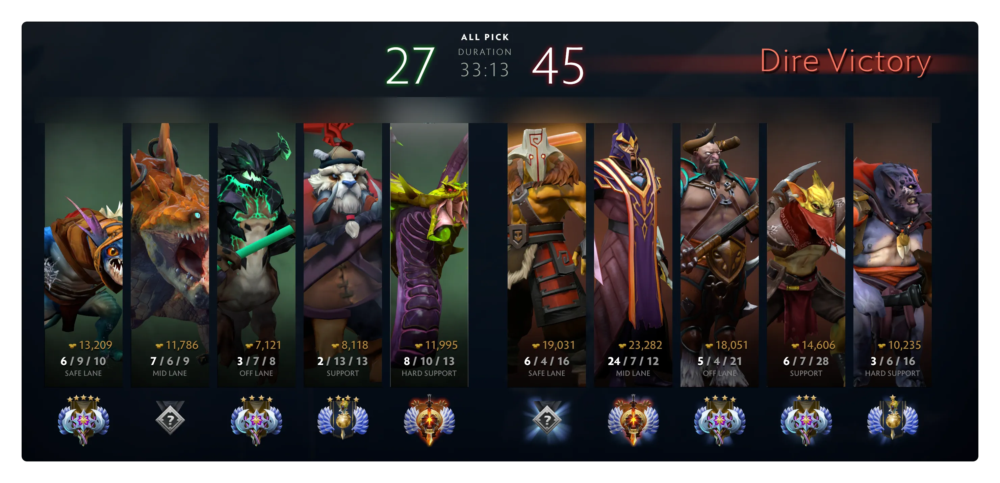
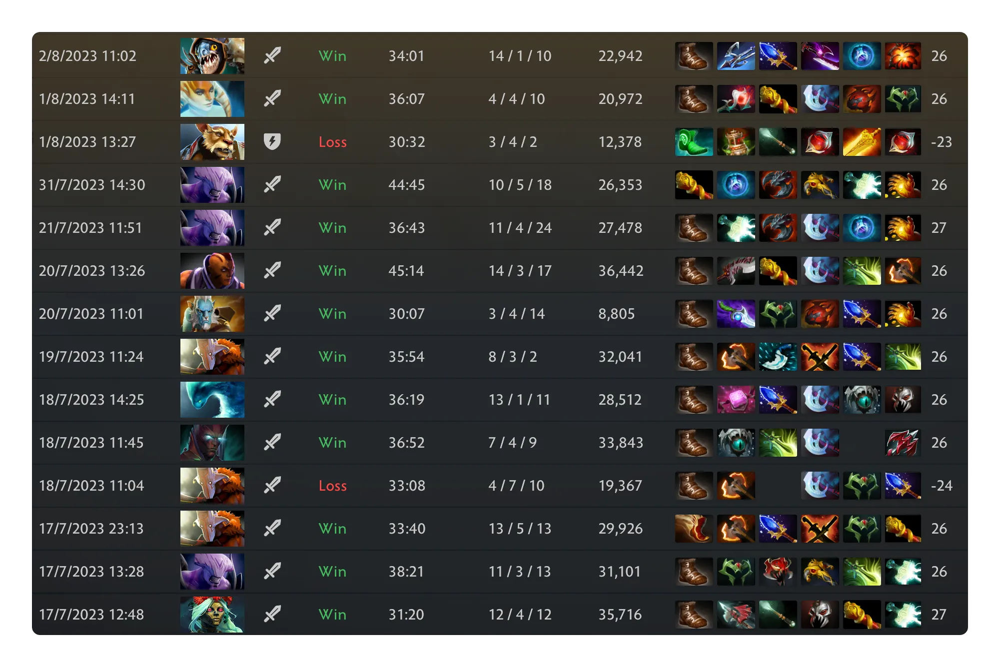
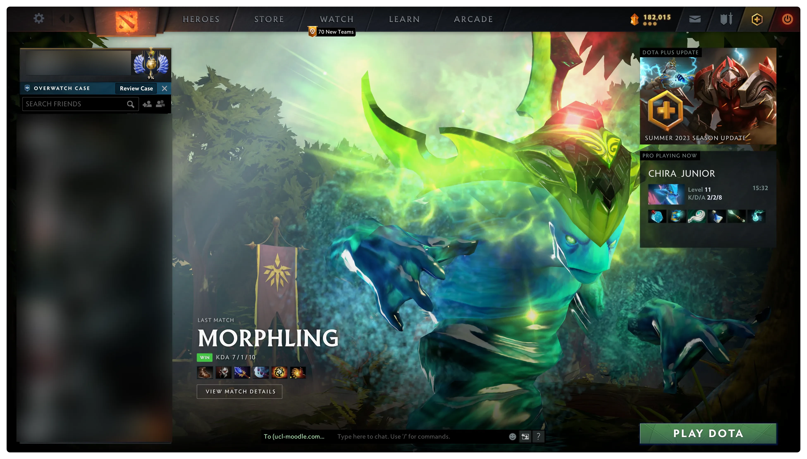
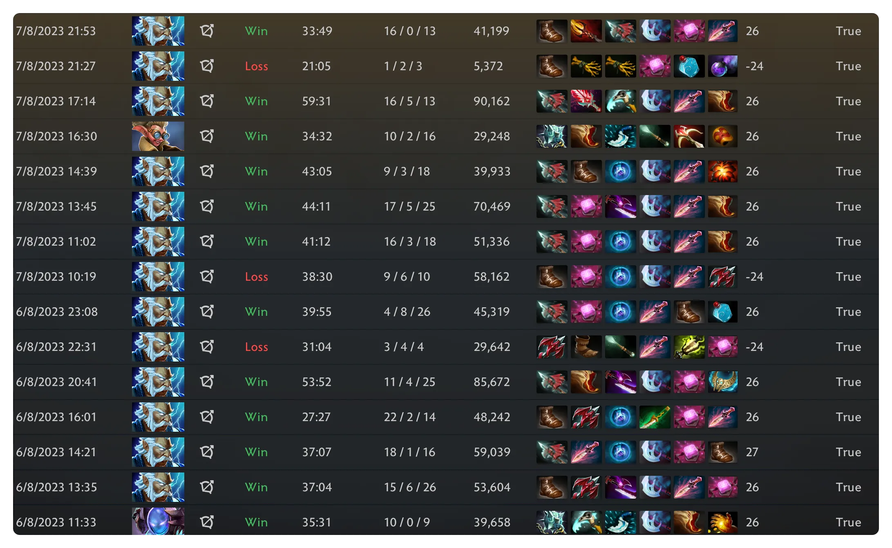
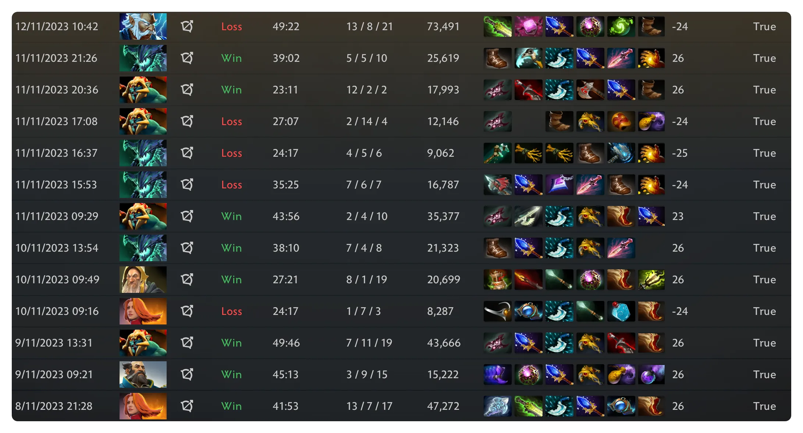
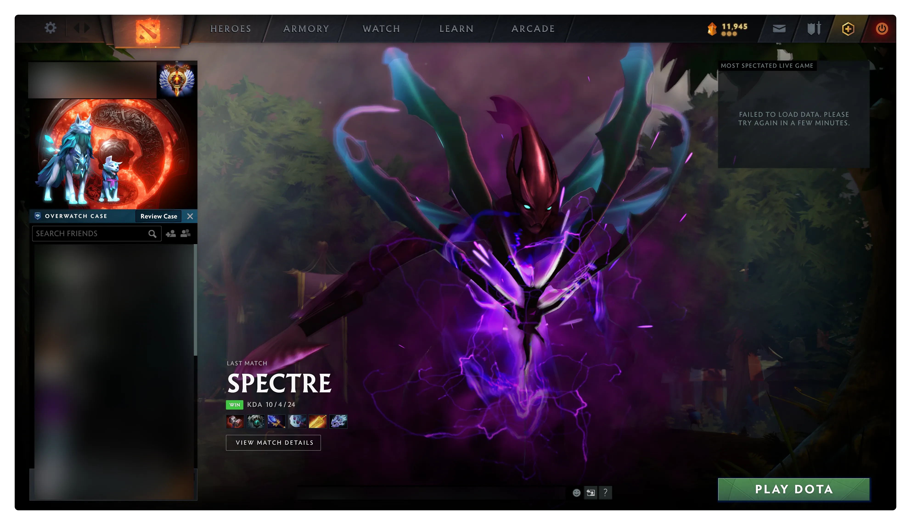
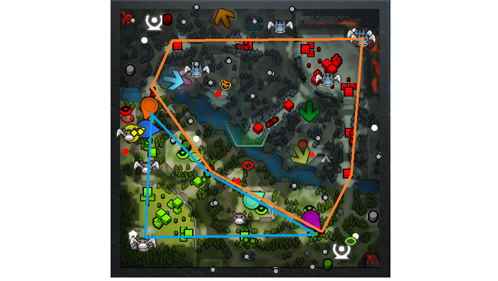

## 上分的历程

我应该是在 2010 年左右接触的 dota, 玩过的第一个版本是 6.67. 后面冰蛙跳到 Valve 并开发 Dota2, 自己也断断续续跟着玩了下来 (虽然多数是在打机器人). 那时候自己好像是传奇段位的水平. 大概在一两年前, 自己有了独立的时间和空间, 心态也逐渐成长起来, 就开始玩匹配. 匹配不会保证玩家处于同一段位, 只会用均分和极值来控制两边玩家的水平. 玩着玩着, 自己开始排到一些超凡甚至冠绝的人, 也有一些少见于同分段玩家的想法, 就想着能不能玩玩天梯试试看.

### 定位: 万古

7.33 更新修改了天梯机制, 很多人说自己的分数变高了, 我也厌倦了匹配时大家的散漫, 决定重新开始玩天梯, 寻求双方都更用心的对抗. 第一盘天梯是今年 4 月 26 日. 印象中那盘排到的人大概有万古和超凡. 因为没有定位次数, 所以只能勾全位置, 然后玩到辅助剧毒. 这盘应该掉了大分, 从第二盘开始, 我就只能排到段位比较低的万古选手了, 最后分数出来大概是万古 1~2 的样子. 那时候感觉自己居然有万古, 好开心.

### 万古到超凡

后面自己度过了一阵子轻松愉快的天梯时光, 印象中最低掉到万古 1, 但很快就开始上分了. 那时候摸不清楚自己擅长的位置, 因为玩中路有机会线上单杀然后串动全场, 所以玩了一些中单, 比如 SA, 紫猫这种的, 但终归还是回到了自己更擅长和舒适的 1 号位. 那时候热门的核心, 比如 Sven, 美杜莎, 剑圣, 血魔, 甚至亚巴顿, 我都有玩过不少, 分数也一直稳稳地上, 但打 1 终究要回到几个传统大核上. 7 月中旬自己玩传统大核, 上了一波大分, 萌生了上超凡的邪念.

月底出去旅游没能继续天梯, 8 月初回来继续玩, 很快靠着一盘水人打上了超凡. 那盘队友中单米波把对面的敌法师抓成了 BOT.

### 顺利的超凡之路

记得自己刚上超凡时, 认为打 1 有些无趣, 每把都是刷钱刷钱然后等到自己强势期发挥. 线上被 3 欺负, 运气不好还要被对面中单游穿. 正巧在贴吧看到一个高手的文章, 说自己玩中单宙斯, 线优后转发育, 一路冲上冠绝. 我感觉很有意思, 就尝试模仿他的玩法, 感觉还挺厉害. 宙斯魔晶刷钱实在是太解压了, 于是我一直玩了好多盘, 居然一直赢, 分数涨得非常快. 当然, 到了 7.34e, 我认为这套思路不再适合多数玩家了.

当时我感觉想上分似乎也挺轻松的, 大概一周就玩中单上到了超凡 3 左右. 除了宙斯 NEC, 我还玩了中单敌法 (打美杜莎黑鸟) 或者大根辉耀血魔 (纯粹想刷钱) 这种东西, 也能打出线优后轻松赢下比赛. 胜利能使人心态漂浮. 那阵子我也没想过上冠绝的事情, 就觉得在这个分段能享受游戏就很快乐了.

> 一般人很难分清自己连胜是因为实力还是因为运气好. 我这次连胜就是运气好而已.

接下来有一波 9 连败, 促使我重新审视自己: 中单英雄池太浅, 自己手活也一般, 碰到许多纯粹靠手活上分的中单会被打爆, 自己比较强的大局观和团战切入无从发挥, 还是应该回到 1 号位. 恰好轮到 PA 被加强, 20% 的暴击和新的暴击机制让 PA 变得很恐怖, 自己玩 PA 能杀二三十个, 只要线上不太劣都能捅穿对面, 最终靠一盘 PA 上到了超凡 4.

### 停滞: 重置与思考

接下来这一段可以说是自己的噩梦. 上到超凡 4 之后, 我不再有长连胜了. 赢几盘输几盘反复循环, 分数一点点往下掉. 九月初那阵子飞机很强势, 我也选了很多飞机, 但胜率仅仅 50 出头而已. 另外我还发现一个问题: 当用尽定位次数时, 我总是被迫玩一盘不擅长的位置. 那会我打别的位置都挺差劲的, 因为上分太快了, 还没熟悉同分段游戏的基本节奏, 所以胜率只有三四成. 一旦输掉比赛, 就只能获得两个定位次数, 然后导致恶性循环.

> 我建议 Valve 把胜利的定位次数奖励改为 5 局, 失败的改为 3 局 (这样均值仍是 4 局, 与系统改动前无论胜负都给 4 局定位的策略相同), 或干脆取消次数限制 (我愿意排 20 分钟确保我只打 1).

9 月我经历了几次长连败, 但一次长连胜也没有. 印象中自己的分数掉到了 5000 以下. 很多局玩的很痛苦, 开局就在内讧, 或者乱选人, 然后很快被对面的正常阵容碾压带走. 那阵子感觉很绝望, 玩游戏也兴致了了, 但又感觉凭自己的实力, 分数不该这样掉. 不记得在哪个论坛, 我刷到一个说法, 重置分数以后队伍会变得正常, 于是我抱着试试的心态重置了分数. 重置的第一盘, 自己就有了久违的正常交流的队伍. 我开心地靠着熟悉的小娜迦获得了一笔大分.

> 从天梯系统的原理上说, 重置实际上是降低玩家置信度, 提高一局游戏的分数变化量. 不过对于连胜连败, 我倒是有一个假设. Valve 可能在每几日过后才更新一次玩家的实力数据. 假设你是一位原住民, 如果这次数据更新中你被判定成了 "赵云", 那接下来的游戏将十分艰难. 当你一页红时, 继续玩只能让自己输的更多, 因为下次数据更新, 给你改成 "阿斗" 的日子还没到. 反之如果你一页绿, 就要继续玩, 直到输掉比赛.
>
> 此外, 一页绿说明你状态好, 要继续上分; 一页红说明状态已经不好了, 要停下休息一阵子.
>
> 总之就是越赢越该继续, 越输越该停下.

此后我的队友真的变得正常了. 定位结束后, 自己置信度没满, 又打了很多 +40 的局, 最终 10 月初时回到了 5288 这样的分数. 然而在置信度变成 100% 后, 在我的视角里, 我的队友又变得不正常, 感觉自己的中单总是被打爆, 劣势路也有一半左右的概率给对面养一个无解发育的核心, 赢一局游戏也变得困难起来. 我再次转回到中单, 思路是选线优英雄, 线上压制对面中单, 中期打架并给自家 1 号位拉扯发育空间, 等他带我躺, 希望能熬过这一段不正常的匹配.

> 尝试用自己的方式来理解游戏, 并结合长期的胜率和数据来客观地审视, 对于我实力的提高很有帮助. Dota 论坛圈子常用的一些简单归因的说法不科学, 对稳定提升实力没有帮助.

这段时间自己在 5200 晃荡了两个月, 在 11 月底上到了 5300 多, 合计 3 个月左右, 100 多场对局, 只上了 100 分. 虽然分没上, 但是这段经历为我带来许多经验性的知识.

### 突破: 冠绝

之前自己一直单排, 极其偶尔和前几盘认识的路人双排. 这阵子机缘巧合, 和传奇分段的朋友一起组排玩天梯, 对手大概是传奇到超凡的水平.

我和人组排时一直怀有愧疚之情, 因为自己觉得玩 Dota 就像下围棋一样, 乐趣主要在解决问题 (达成游戏获胜), 次要才在套路 (非要玩某个英雄或某种玩法, 对应围棋中非要先洗后捞或非要大模样), 并且指出别人的问题时也不怎么学得会嘴下留情 (嘴下留情的后果就是放任他在随机的胜负中挣扎, 长期来看更残忍吧).

不管怎么说, 朋友作为常玩核心的选手, 愿意屈尊为我打 5, 我也教给他各种保线的技巧. 依靠大树, 骨法, 双头龙, 尸王, 巫医这样的英雄, 我可以从容选大核, 作为队伍中分数最高的人扛起托底的大旗. 也正是这一段时间, 我有机会在天梯中离开自己的分数段, 学习到新的能力.

> 自从选人阶段开始, 我就会观察场上的其他 9 名选手的行为, 尝试揣摩他们的水准. 这关系到队友能否理解我的意图并与我配合, 对手能否对我的发育或切入造成限制.

我们经常对位到超凡的 3,4 号位, 甚至代练哥. 他们会选富有侵略性的线上组合并做良好的配合. 一旦处理不好, 我们将被打通关. 朋友的 5 给我许多惊喜, 我认为他玩辅助的实力远在其分数之上, 我们组排上分是借了他的东风.

> 我的对线技巧一直在同分段中偏弱. 这段时间的训练让我熟悉了许多 5 的保线特点, 并且更重视寻找击杀机会.

组排大概到超凡 5, 我们的队伍中经常只有我一个超凡, 对面甚至会有 3 个超凡. 我们 2+3 的队伍中, 那 3 个人往往从中期开始就无法起到作用. 有些万古玩家既不听指挥, 又做不了正确的事. 打不开地图信息, 还要刷光你的野区, 打团永远后手切入追求收割, 或者打明显打不了的先手送波大的, 让我很是懊恼.

> 判断力不足时, 最好听从队伍中高手的建议, 切勿遵循肌肉记忆行事. 如果大家水平差不多, 就优先听最肥的, 或者背负翻盘希望的那名玩家指挥, 因为你别无选择. 等到真的没机会了, 实在想对他口吐芬芳也不迟.

这阵子我也偶尔单排. 队友多数都是冠绝哥, 分数比我高, 也比我靠谱. 哪怕有人出了问题, 队伍也都心照不宣地明白问题的来源, 并做最利于团队胜利的事. 我意识到需要通过单排来达到新的高度.

之前超凡 4 左右时也偶尔能乱入冠绝桌, 那时明显感觉对局质量高, 但是自己是那块短板, 跟不上比赛节奏. 最近自己打 1, 感觉对面很少有强过自己的 c 位了. 转回单排后, 我赢下了几盘劣势的局, 并把握住了所有优势局, 终于以 8 连胜的大骨灰幽鬼到达了冠绝.

🎉 拿下冠绝之后真的好开心! Reddit 上一个水友说的话我觉得非常好: 冠绝是 "good mechanical play" 的最低要求. 相比之下, 先锋玩家 "do next to nothing correctly". 就我自己的体验而言, 自己上分的过程就是修正自己游戏内外的各种认知的过程.

Dota 是一个更偏向于大脑而不是肌肉的游戏. 正因如此, 它才成为我娱乐生活的一部分. 我常把 Dota 比作 21 世纪的围棋, 它像一个复杂, 充满随机性而又有迹可循的最优化问题, 令擅于思考又追求刺激的人着迷. 在这件事情上曾经达到一个可以令自己尽情享受的水准, 我感受到无比的幸运.

## 一些心得

作为无天赋玩家, 一步步爬天梯上来, 许多新鲜热乎的想法也许对别人或未来的自己很有帮助, 如果不记录下来就太可惜了.

### 各位置职责

很难明确说各位置的职责, 因为不同英雄擅长的领域不同, 并且要做的事情也随着局势而变化. Dota 是充满变化的游戏, 在未确定阵容和场上局势之前, 任何说法都可能是偏颇的. 但对于相当一部分的对局, 大致的思路可能是这样的:

- 1 号位: **假设不是打架核.** 度过对线期, 积累能支持自己扣野的装备, 然后去扣野收线, 让自己强势期尽可能早; 强势期到来后, 尽早寻求机会终结比赛.
- 2 号位: **假设不是发育核.** 在选人上, 要么不被克制, 要么很克对面; 对线尽可能胜出, 到 6 后不错过收割机会; 尽早提升战斗力, 带队进攻英雄或塔从而得利; 如有机会, 压制对方核心, 为己方核心争取发育空间.
- 3 号位: 不太懂. 我的期待是: 线上压制对面核心, 使其难以过渡到扣野期, 并尽早拿掉一塔; 团战作为启动点或支点, 为自家输出点争取切入机会; 如有机会, 持续压缩对方核心的打钱空间.
- 4, 5 号位: 同样不太懂. 我的期待是: 优先保线, 其次帮中单控符并作为润滑剂让他启动; 时机适当时坐门进攻或支援; 交战时补足伤害, 控制或救援核心.

> 在这里我提到的核心是指 1, 2, 3 号位. 辅助是指 4, 5 号位. 位置序号本质上是分配资源的优先级. 大致可以认为, 半个地图的资源只够 2~3 个玩家获取, 所以一个队伍只有 3 个核心, 想要更多的资源就要从对方手上拿.

### 不同分数段的特点

在我当下的视角里, 万古和传奇分段差不多, 都是不太会走路的感觉. 万古的手活和经验往往比传奇多, 但也更容易盲目自信. 这部分人往往没有伤害判断和距离判断能力, 技能也不会甩. 许多场次的胜负往往取决于中后期哪边大哥先犯错, 或哪边中单赢了对线.

万古 5 和超凡 1, 2 差不多, 已经比较有经验了. 超凡 3 可能是个分水岭, 这里就会碰到许多偏科生, 不能让他们进入擅长的领域.

到超凡 4 我就不配评价了. 我觉得在这个分段, 心态良好的玩家可以理解做什么有利于获胜. 核心能够狠下心来发育, 辅助能够支撑好团队的弱项.

> 在固定玩家天赋的前提下, 画一条平面曲线, $x$ 轴是付出程度, $y$ 轴是玩家实力, 那这条曲线肯定是上凸的.

### 兵线和空间

兵线一般指最靠前一波小兵行进或交汇的位置. 自古以来, 在 Dota 世界中, 跨过兵线进攻是比较困难的 (需要跨过高台眼和小兵的视野, 所以有了雾). 另外, 没有兵线时, 一般也不能进攻防御塔.

> 小兵提供的经济非常高效. 我们往往能看到许多残血小兵, 一个技能就能收走, 清完小兵还能顺路去扣野, 所以小兵要尽可能留给核心. 对于辅助玩家, 如何判断哪些兵能收也是一门必修课.

将三条兵线的位置和己方建筑相连接, 围成的多边形区域大致就是我方的活动范围. 这个范围的安全程度与我方视野眼和防御塔的分布有关. 防御塔相当于一个支点, 允许你 tp 过来支援, 同时阻挡兵线.

> 推进的一个目的就是永久地缩小对方的安全活动范围. 当然, 想要胜利必须组织推进, 因为游戏目标就是摧毁对方的遗迹.

### 如何 BP

BP 首先考虑对线, 然后考虑如何取胜. 有些阵容可以直接在对线时击垮对手, 让对方没有资源, 这样打团再怎么被克制都无所谓了. 如果想不出哪个英雄可以赢下对线, 就想办法处理对方已选出的英雄, 或者选那些克星都被 ban 掉的英雄.

一般我们前两手先选 3, 4, 5, 最后一手留给中单, 这样对方很难通过选人而克制我们的一路, 被克制了也可能是运气不好.

当前版本的中单应该尽量选择线上强的英雄, 哪怕偏发育也接受, 只要你不抢 1 的钱, 并且不要吸 3 吸得太狠, 让他只能开摆.

### 进攻: 推进, 抓人与团战

进攻的手段无非就这三种. 所谓压制 ("jail them", 让他们坐牢), 本质上也是对方因为畏惧被抓或无法赢下野外团战而不敢出门.

只要你能理解兵线, 并具有伤害判断和强弱判断能力, 就可以知道什么时候我们需要推进或抓人 (或什么时候对手可能推进或抓人, 以及我们是否能接). 例如, 断掉兵线, 绝大多数英雄都无法推进. 等下波兵线过来, 半分钟过去了, 我方阵亡的关键人物可能就复活了.

进攻时往往会产生团战. 团战是 Dota 最耗费人精力的部分. 现在的 Dota 版本中, 往往五个人在团战中都有机会一锤定音. 许多时候看录像能看清团战, 但玩的时候却远远看不清, 你需要以最快的反应速度抓住机会并防止对手抓你破绽.

> 举个典型的例子, 在 7.34e, 幽鬼全分段强势, 一个原因就是幽鬼自带切入, 打团时有机会先观察, 快速找到最优解, 然后进场; 敌法师的胜率与分数正相关, 因为这英雄对核心玩家的综合素质要求较高 (看阵容, 对线, 刷钱, 切入). 分数低的玩家看不清团战, 难以发挥敌法师的威力.

### 1 号位的要点: 终结比赛能力

玩 1 号位有很多机会终结比赛 (比如自己在队伍绝望时强行出去切掉兵线, 然后被抓死). 以下是我快速终结比赛的经验:

- 抓住一切机会优先收线 (但别死)
- 打不过时, 趁队友打架, 推掉对面的塔 (一般赢波团才能推个塔)
- 后期局势焦灼时, 随时准备赢下团战后将对手一波带走. 记得框银月黯灭
- 强势期到来后, 赢团, 控盾, 打对方劣二塔, 带走魔晶, 获取巨大战后利益 (极大提高容错)

### 键位和 Dota Plus

建议用固定键位 (QWER, 1234, ERDT 等). 对于不需要精确确定距离和范围的技能, 尽可能用快速施法. 如果玩 Tinker 这类英雄, 一定要快速施法. 许多物品也应该快速施法.

> 经常看到职业选手加错点或者吹风吹别人时鼠标没点到从而吹了自己. 如果用固定的键位和快速施法, 这些问题都不会发生. 这就是一件应该去改变, 去适应的事情.
>
> 不要告诉自己 "我适应不了", 不要把一局的失利归结于 "我刚改键, 放错技能了". 这样归因是短视的表现.

Dota Plus 可以看到玩家的平均水准和科学的推荐出装, 在你对局数量不足时帮助你补足经验上的缺失, 可以拉黑玩家, 可以方便地看到自己的分数变化和各种数据. 想要认真上分, 推荐订阅 Dota Plus.

> 例如, 很多低分段的敌法师碰到军团时, 需要 Dota Plus 来提醒自己可以出一个林肯.

### 失误和心态

玩 Dota 时失误应该是在所难免的. 如果选手的多数比赛都少见失误, 那我觉得他差不多有 TI 冠军级别. 这游戏要你做的事情太多, 无论是繁杂的操作还是许多难以抉择的决策分支, 都容易引起玩家失误.

失误或犯错误, 就会引起玩家心态上的问题. 心态不仅是游戏层面的能力, 更是为人层面的能力. 越成熟的人, 越不容易被 "tilted". 有些人也习惯把一些不满直接抒发出来, 以此迅速调整心态, 最终目的还是为了更接近游戏的胜利 (比如我?).

你的队友是何种水平, 在你排到他们时就已经确定了. 你们既然是同一分段, 就各有长处短处. 你能看到他的失误, 他也能看到你的. 哪怕你指责他的失误或错误, 他也无法在这局游戏中改变, **不如想想自己该做什么事**. 根据我的经验, 分数越高的玩家, 这方面做的越好.

**保持良好心态的诀窍是, 始终告诉自己, 只做对胜利有帮助的事.** 这样你就能自然地顺势而为, 根据局势选择更优解.

> 心态好的时候, 你的头脑也更清晰. "做正确的事" 比 "做更多的事" 更重要.

### Dota 值得享受的地方

在我看来, Dota 基本上可以说是一个 Mind Game, 当然也融合了一些刺激的 "格斗" 成分. 这种快感有点像战争, 最关键的是制定正确的战略 (我们去打盾吧), 但达成战略需要战术的优秀 (盾团得把技能放好). 基本上这就是人类最顶级的快感, 没有之一了.

围棋被称为 "手谈". 水平相差过大的人下棋很容易无趣; 水平相似的人下棋, 不论水平高低, 都有种相互会意, 相互理解的感觉, 很有滋味. 当然, 水平越高, 这种滋味也越浓厚.

> Dota 就是十人的手谈.

很偶尔的时候, 我能玩到十个人思路手活都在线的一局 Dota, 打完能回味好几天 (不管胜负). 有时我和队友能通过游戏中的行为, 无需交流就看出对方是靠谱的人. 这时我们可以做更信任彼此的配合, 当然游戏体验也是更上一层楼. 反之, 有些人缺少游戏实力, 在我的眼里就像不会走路一样, 我会为和这种人一起玩游戏而感到无趣.

提高实力以后, 既能摆脱 "不会走路的人", 又能和更多的高手在思维上同步. 这种欣喜的感觉也是独特的.

## 总结

好像没有很成体系地写一些东西, 只是抒发了一些开心的情感 (毕竟真的很开心啊).

很想聊聊自己对水人, 虚空, 幽鬼, 敌法, 小猴子, 哈斯卡, 骷髅王, CK, 小娜迦等英雄的理解, 可惜写累了, 感觉写出的内容没什么干货了. 往上还有无数多的职业选手和高分主播. 想要学好一个英雄, 看这些人的直播, 或多利用客户端的观战和录像即可.

毕竟 Dota 太复杂了, 但它有趣不也正是因此吗?

- 2024.01.02 后记: 和朋友聊天时, 总结出了自己从万古到冠绝的过程中各个分数段提升的能力:
  - 万古 3 ~ 超凡 1: **甩技能.** 大致判断双方技能的范围和伤害, 确保自己尽可能在恰当的位置放出技能.
  - 超凡 1 ~ 超凡 4: **经验.** 从对局中总结英雄克制关系, 学会处理常见组合的对线. 更重要的是, 大量对局提升了心态.
  - 超凡 4 ~ 冠绝: **局势判断.** 分析阵容和双方玩家水平, 对局势走向做出预测, 从而发现强弱势的点并加以针对. 局势优时, 迅速扩大优势并简化比赛; 局势劣时则相反, 通过带线和抓单使得比赛复杂化.
- 2024.02.28 后记: 更新版本后, 中单对局势的影响力大幅度增强, 很多 1 号位英雄难以上场. 这段时间自己只是随意玩玩 dota, 手法退化得非常快, 但也和高分朋友交流获得了许多理解上的提升. 现在大家更注重于从大局方面把握胜利的方程式, 而不纠结具体场景下的发挥. 一种主流的玩法是, 选择线上强力的英雄, 轻松压制对手, 然后在 20 分钟之前占据主动, 对手就很容易崩盘. 除了虚空小鱼, 自己和很喜欢选炼金美杜莎露娜这样的英雄, 能打线和钻野, 也能在自己的绝对强势期发挥作用.
