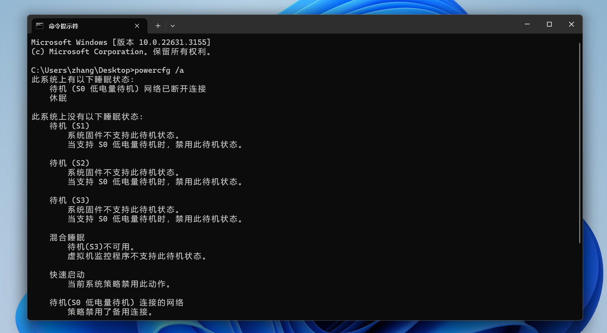

**太长懒得看: 拔下电源再合盖, 以防止网络唤醒后台更新等任务.**

## 微软的新式待机 (Modern Standby)

Modern Standby 又叫做 S0 待机. 请参考微软的 [官方解释](https://learn.microsoft.com/zh-cn/windows-hardware/design/device-experiences/modern-standby): "为了响应用户输入, 来自网络设备的中断和其他硬件事件, 可以按需转换到活动模式. 在停止所有软件活动, 并且打开和关闭 SoC 的设备进入低功耗状态后, Windows 会将 SoC 从活动模式转换为空闲模式."

多数笔记本电脑合盖时默认进行 S0 待机. 当 S0 待机时, 笔记本电脑的网络活动开启, 故会进行后台更新, 在合盖时消耗电量.

## 检查 S0 待机的支持情况

如图. 在终端中输入:

```shell
powercfg /a
```



如果默认支持的是 S3, 那大可放心, 笔记本通常不会在进入此待机模式后掉电; 如果默认支持 S0, 请确保后续显示的是 "网络已断开连接". 一些设备似乎会在连接电源时显示 "网络已连接", 而在拔下电源时显示 "网络已断开连接". 如果这样, 请**先拔下电源再合盖**即可.

另外, 这里显示的 "低电量待机", 原文是 "Low Power Idle", 应翻译成 "低功耗待机".
