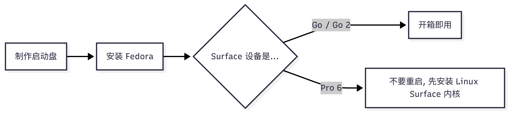

人生真的很辛苦, 五年前的 Surface Go 却能在角落里悠闲地吃灰, 实在是令人难过. 给它装上 Linux 让它重新开始服役吧.

> **设备:**
>
> - Surface Go 1 / 2
> - Surface Pro 6
>
> **系统:**
>
> - Fedora Workstation 40 / 41
> - Linux Surface Kernel 6.10.10

## Why Surface?

Surface Go 可能是当今还能服役的性能最弱的 Surface. 在 Windows 11 下, 我手上的 Go 随便用两下就开始发热, 然后降频到任务管理器都打不开. 然而这台设备的形态太合我心意, 要是能用上那就太好了.

### Go / Go 2 参数简介

- **形态**
  - 平板电脑, **自带背部支架**
  - 10 英寸屏幕, 1080p 分辨率, 良好的色准和亮度
  - **~500g 重量**
- **性能**
  - 处理器很弱, 只擅长浏览网页, 做文字编辑
  - 4~5 小时续航, 25 wh 电池, 约 1 小时充满
- **扩展**
  - **全功能 USB-C** (数据传输: 5Gbps 或 10Gbps, 视频输出: DP 4k 60Hz, 供电: 30W PD)
  - **支持手写笔**
  - Surface Connect 接口可用 Surface Dock

> 感觉 CPU 换成 Steam Deck 或 Rog Ally 上用的那种就接近完美了.

## Why Linux?

那天扫到了 [这个 B 站视频](https://www.bilibili.com/video/BV1iaHweLEFU), 感觉还可以, 于是就去 [Linux Surface](https://github.com/linux-surface/linux-surface) 仓库看了一下, 支持性良好. 考虑到 Linux 系统负担轻些, 使用体验也好些.

直觉告诉我其实是为了转移注意力, 尽量用心生活 OvO 🍀

### Why Fedora?

几个特性是我所需要的:

- 由组织维护
- 对 Surface 支持良好
- 平时用起来不费太多精力

Fedora 完全符合这几点:

- Gnome 桌面环境, UI 美观, 触屏友好, 多显示器友好
- 有应用商店, 支持 rpm 和 flatpak 包

## 安装指南

请先确认 [Linux Surface](https://github.com/linux-surface/linux-surface) 的 Feature Matrix, 确定自己的 Surface 哪些功能会受到影响, 然后再考虑是否要安装 Surface.

印象里一些设备被汇报了不少 Bug, 尤其是 Surface Laptop Studio 和 Surface Book, 需要自行确认相关 Issue.

### 准备工作

需要:

- 充满电的 Surface
- 能接入 Surface 的 USB 启动盘 (Go 系列需要 TypeC)
  - 使用 USB Hub 转接可能带来额外麻烦. 部分一拖 N 的 Hub 只有一个接口能用于启动
- 流畅访问 Github 的网络
  - 比如, 预先备好机场的订阅地址和梯子客户端的 rpm 包, 用 U 盘拷过去
- 确保有键盘和鼠标连接到 Surface
  - TypeCover 就可以

### 流程

1. 制作启动盘
2. 安装 Fedora
3. 根据 Surface 设备不同...
   1. Go / Go 2: 开箱即用
   2. Pro 6: 不要重启, 先安装 Linux Surface 内核



#### 制作启动盘

从 Fedora 官网下载 Workstation 版 ISO 镜像, 然后用 [Ventoy](https://www.ventoy.net/) 制作 USB 启动盘, 将镜像文件拷入即可.

> 我建议使用 **Ventoy** 制作 USB 启动盘. 选择 **MBR + NTFS** 的配置. Fedora 官方推荐的 Media Writer 在我这里卡 Logo, Rufus 尝试了各种配置也不行.

#### 安装 Fedora

请严格按照以下顺序做:

1. 进入 Surface 的 UEFI, **关闭安全启动**, 在启动顺序中提升 USB Boot 优先级到最高
2. 在接入 USB 启动盘的状态下开机, 选择 Fedora 镜像启动. 此时将进入 Fedora LiveOS (这是一个用来安装 Fedora 到磁盘的 Fedora 系统)
3. 按 LiveOS 的引导完成安装即可.

> 关于 UEFI:
>
> - 如何进入 UEFI: 按开机键使 Surface 开机, 然后持续按住 `音量+`, 直到 UEFI 界面出现.
> - Linux Surface 的 Guide 也许认为可以打开安全启动, 但是我在打开后无法进入 Fedora LiveOS.

> 进入 Ventoy 的镜像选择界面时, 如果你在用 Surface Pro, 那么选择 `boot in grub2`; Go / Go 2 用 `boot in normal mode` 即可.

> 输入设备: Surface Go 在 Fedora LiveOS 中可以正常使用 TypeCover 键盘, 触摸屏, 手写笔; Surface Pro 的 TypeCover 能用, 但我不确定蓝牙键盘能不能用.

- 如果是 Go 系列设备, 现在重启并拔掉 U 盘, 进入磁盘中的 Fedora 系统即可正常使用除相机外的所有功能 (网络, 蓝牙, TypeCover, 手写笔, 音响, 麦克风, s2idle 挂起).
- 如果是 Pro 6, **切勿重启**, 现在需要在该 LiveOS 中为**磁盘内的 Fedora** 安装 Linux Surface 内核.

> Fedora 41 下, Surface Go 2 实测已经有了开箱即用的相机. 固件 `intel-vsc-firmware` 和库 `libcamera` 已经预装在 Fedora 中.

#### 安装 Linux Surface 内核

> Fedora 40 下, Surface Go 系列的相机需要 Linux Surface 内核才能使用.

如果是 Surface Pro, **不要重启**. 由于一个很巧合的固件问题, 重启后设备可能再也进不去 Fedora 了 (此时只能再重装了). 需要在该状态下安装 [Linux Surface](https://github.com/linux-surface/linux-surface) 内核, 然后才能重启. 需要做的是:

- 挂载到磁盘中的系统: `sudo chroot /mnt/sysimage`
- 按照 [指引](https://github.com/linux-surface/linux-surface/wiki/Installation-and-Setup) 安装 linux-surface 内核. 务必等成功安装后再重启.

> 有几个 100 MB 左右的包要下, 此时可能需要在 LiveOS 中部署梯子了.

> 一些参考资料:
>
> - [Github Discussions](https://github.com/linux-surface/linux-surface/discussions/1455)
> - 还有一些 Reddit 的 Post, 我找不到了

如果懒得看 Github 的 Guide, 我这里有个中文版本:

1. 添加 linux-surface 仓库: `sudo dnf config-manager --add-repo=https://pkg.surfacelinux.com/fedora/linux-surface.repo`
2. 安装 kernel: `sudo dnf install --allowerasing kernel-surface iptsd libwacom-surface`
3. 安装安全启动支持: `sudo dnf install surface-secureboot`. 接下来请记得, 系统在重启时也会弹出一个蓝色的 Mok 注册界面. 根据提示操作, 密码输入 `surface` 即可.
4. 配置如下的脚本, 确保 surface kernel 始终优先于原始内核启动: `sudo systemctl enable --now linux-surface-default-watchdog.path`, 然后 `sudo linux-surface-default-watchdog.py`.
5. 重启计算机, 现在应该弹出蓝色的 Mok 界面. 选择 Enroll Mok, 然后 Continue, 随后在 grub 界面选择带有 surface 字样的 kernel 启动. 如果现在 `uname -a` 的输出包含 "surface" 字样, 则 linux-surface 内核安装成功.

> Fedora 的 Gnome 终端用 `ctrl+shift+v` 来粘贴文本.

> 如果在蓝色的 Mok 界面误选了其他选项导致不能开启安全启动, 可以手动重新安装 [secureboot-mok](https://github.com/linux-surface/secureboot-mok). 执行如下命令: `sudo dnf install linux-surface-secureboot-mok`, 然后重启, Mok 注册界面应该正常弹出.

## 使用体验

### Surface Pro

Surface Pro 的触摸屏手感很奇怪. 我从 Linux Surface 内核开始说起.

IPTSD 是 Linux Surface 内核中用于管理 Surface 设备触控 (触摸 + 手写笔) 的模块. 我的 Surface Pro 6 遇到了如下问题:

- 只有大拇指有灵敏的触控, 其他手指需要很用力才能响应触控
- 没有 Palm Rejection, 尤其是在 Surface Pen 手写时.

第一个问题: [Issue 171](https://github.com/linux-surface/iptsd/issues/171) 有解释, 这应该是一个暂时的问题. 按照其中的指引:

1. 按照 [IPTSD Wiki](https://github.com/linux-surface/iptsd/wiki/Calibrating-iptsd) 的指引校准数据.
2. 在该文件中按 [Issue 171](https://github.com/linux-surface/iptsd/issues/171) 所述添加参数.

重新启动 IPTSD 相关服务后, 现在应该可以让 Surface 在支持手写笔的同时正常进行多指触控.

第二个问题: 为 IPTSD 打开 `DisableOnStylus`. 在配置文件中写入如下内容:

```
[Touchscreen]
DisableOnStylus = true
```

另外还有 `DisableOnPalm` 参数可以开关. 这两个参数被打开时, 似乎都影响手指触摸的灵敏度 (莫名其妙), 在使用多指触摸时更加明显. 就我这边的体验而言, `DisableOnPalm` 打开后仍存在误触, 并且让手写笔的输入变卡顿 (又是莫名其妙), 所以我选择仅打开 `DisableOnStylus`.

顺便一提, 微软自己对于防误触的处理就是单纯地禁用手写笔光标右侧 (或左侧, 如果在 Windows 设置中设置惯用手为左手) 的所有触摸屏输入.

### Surface Go

Surface Go 初代的性能实在不够了, 我这台在 Windows 上一旦略微发热就降频到完全不可用. 另外 Surface Go 全系的手写笔输入体验完全不行 (也许应该算微软虚假宣传?). 这台设备安装 Fedora 上以后唯一损失的是 IR Camera (也就是 Windows Hello 解锁用的摄像头), 因此不能用人脸登录账户. 除此之外, Fedora 的体验还挺好. 尤其是用 Xournal++ 做手写时, 在抖动处理中可以开启算术平均 (如果觉得不流畅, 就调低缓冲区大小), 采样率低的问题解决了, 文字笔记的书写体验相当好 (因为它相当轻, 而且 Linux 下写字时不发热了).

我本以为 Surface Go 2 会更接近完美: 更大的屏幕, 更标准的分辨率, 更强的性能 (可以睿频意味着日常使用舒服很多), 结果 Xournal++ 上的体验和在 Windows 上一样**不好**, 压感完全坏掉了. 一个明显的表现是, 无论在哪个平台上缓缓提笔时笔迹都是突然消失 (而不是淡出). [YouTube](https://www.youtube.com/watch?v=2EACegmHGA4), [YouTube](https://www.youtube.com/watch?v=_y2yayuq7_M), [Bilibili](https://www.bilibili.com/video/BV1pq4y147oF) 中说明或表现了相同的现象, 无论 Go 2 还是 Go 3 都是如此. Go 2 后续的固件似乎也没有调整这一点.

明明 Go 和 Go 2 距离不经意间发现的完美如此接近, 却都差一点才能到达. Such is life.
