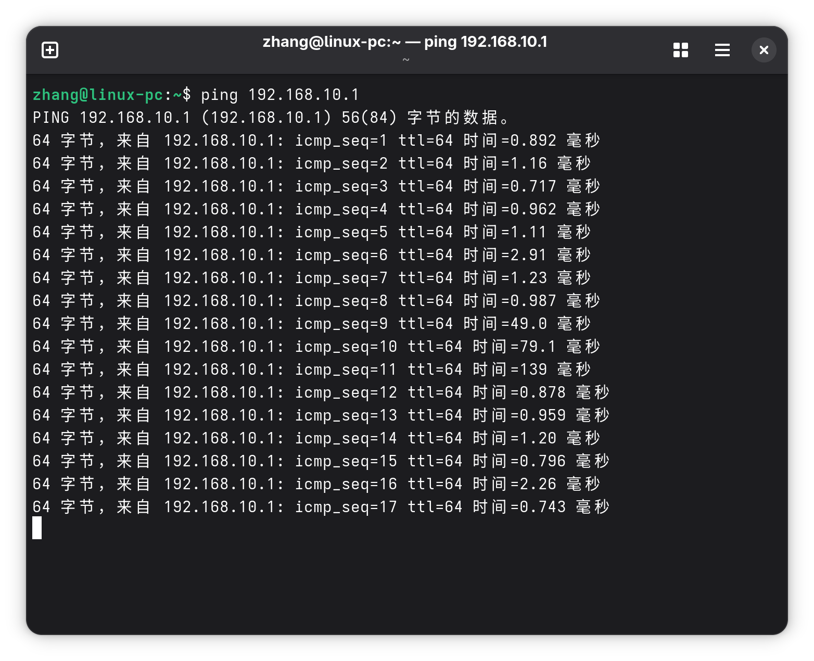
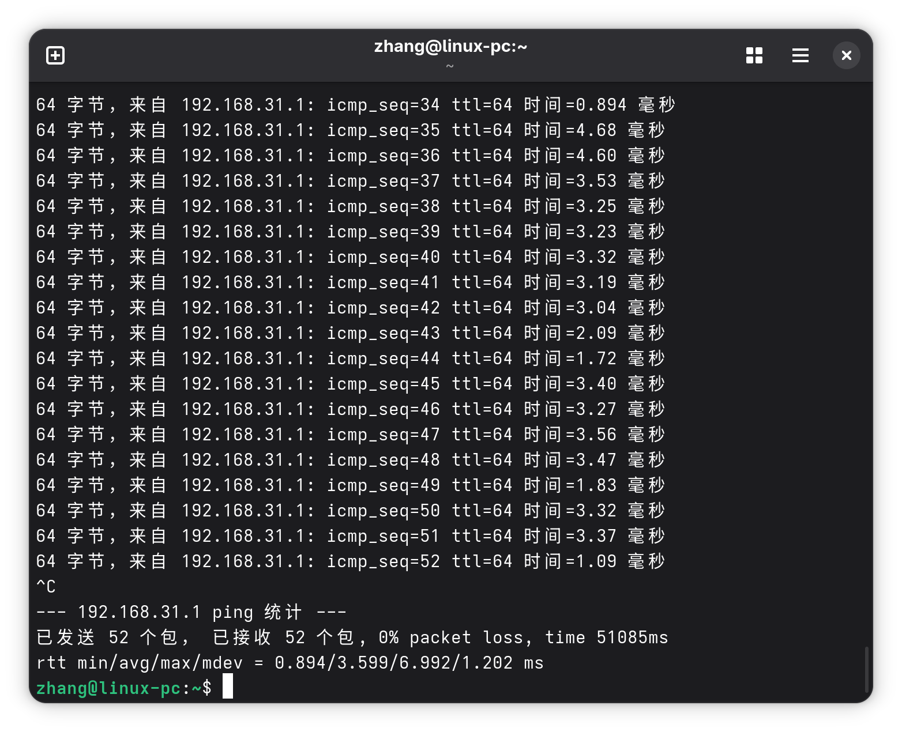

我已经在 Surface Go 上尝试了 Linux, Fedora + Gnome + Wayland 简洁优雅却又存在许多小问题, 非常适合在忙碌的工作后进行体验和探索. 现在我为自己的 SFF PC 装上了 10 月刚刚发布的 Fedora 43. 这是一个非常现代化的 Linux 系统, 但过程中也踩了不少坑.

我的硬件列表:

- MB: Asus B650e-i
- CPU: AMD 7950X
- GPU: Nvidia RTX 4060
- SSD: M.2 nvme 2TB
- Mem: DDR 5 32gb×2
- NIC: MediaTek MT7922 -> Intel AX210

总的来说体验并没有想象中的好, 有许多问题需要我们亲自动手解决.

## 系统与硬件

对于个人用户, Linux 的硬件兼容性**远差于** Windows. 我踩的坑主要集中在:

- Nvidia 显卡
- MediaTek MT7922 网卡
- 休眠和挂起
- Wayland

这些问题是硬件, 驱动, 系统多方面造成的. 这些问题很容易发现, 开发者们只是忽略了问题或简单认为其 "不重要" 或 "能被用户解决", 然后直接发布新的系统 / 驱动. 我讨厌这种行为.

我可以在下文列出具体的问题.

### Nvidia 显卡

Fedora 下的 Nvidia 驱动建议按照 [RPM HowTo: Nvidia](https://rpmfusion.org/Howto/NVIDIA) 安装.

- 如果使用 Nvidia GPU, Gnome 向导会在设置时区时[崩溃](https://www.google.com/search?q=fedora-43-fresh-install-freeze). 此时还没创建初始用户 (所以甚至没法在 tty 里登录然后 `dnf update`).
  - 解决方案: 拔出 Nvidia 独显, 用核显完成向导 (如果用户没有核显就坏了...).
- 许多 Steam 游戏在启动时直接崩溃. [一些游戏](https://www.reddit.com/r/linuxquestions/comments/rkjcxj/what_does_proton_use_wined3d1_command_do_when/)通过启动参数修复; [另一些游戏](https://github.com/ValveSoftware/csgo-osx-linux/issues/3628)则需要 GPU offloading hack. 我确定 dp 线接入的是 Nvidia 独显, `nvidia-smi` 已经正常工作, 且 `vkcube` 正确调用了 Nvidia 独显.
  - 解决方案: 最快的解决方案就是禁用核显, 只使用独显.

> 对于这块华硕 b650e-i, 找到 `高级\启动\CSM (兼容性支持模块)\开启 CSM`, 将其设置为 `开启`, 即可禁用核显. 根据客服的说法, 用这种方式禁用核显后, 一旦独显故障, 只需将视频线接回主板, 核显仍然能输出画面, 以便我们重新启用核显. 顺便一提, 之前我看过一种说法: Linux 对 "核显输出, 独显计算" 有原生支持, 这令我很是心动, 甚至想买一块 Tesla P4 来体验一下. **还好我没这样做.**

### 网卡

mt7922 网卡简直是问题大户. 它在 Windows 下极其稳定, 但在 Linux 下会[跳 ping](https://www.google.com/search?q=mt7922+ping+spike+on+linux), 且有些 Wifi 能搜到但是连不上.



- 暂时的解决方案: 用手机的 USB 网络共享.
- 我也做软件上的尝试. 不管是 [Arch Wiki](https://wiki.archlinux.org/title/Network_configuration/Wireless) 还是其他各种尝试 (cpu 调度, 服务或驱动关闭 powersave, 更新软件包, 限制 WiFi 频段, BIOS 关闭 fTPM, 更换 NetworkManager 后端), 都不能解决问题. 一些讨论见 [cachyos](https://discuss.cachyos.org/t/high-ping-spikes/13151),[frame.work](https://community.frame.work/t/responded-mt7922-poor-performance-fedora-6-7-7-200-fc39-x86-64/46817/3),[arch](https://bbs.archlinux.org/viewtopic.php?id=306521),[reddit](https://www.reddit.com/r/linux4noobs/comments/1l4rc4c/issue_with_latency_on_mt7922_mediatek_wifiadapter/).
- 我确实不太懂这里的知识, 一度很迷茫...
- 最终解决方案: 更换 AX210 这类兼容良好的网卡, 然后将 `NetworkManager` 后端改为 `iwd` 以避免 background scanning 导致的 ping spike. 因为 itx 主板没有第二个 pcie, 我拆掉主板, 然后[替换板载网卡](https://www.youtube.com/watch?v=V4DUIlJYBRc). _在我打开小铁盒时, 一根天线断掉了 :( 好在一套 "ipex 4 代转接线" 在国内只值 5 块钱 :)_ 此时可以正常联网但还有 ping spike. 接下来, 换掉 `NetworkManager` 后端:

```bash
# 1. 安装 iwd
sudo dnf install iwd

# 2. 配置 NetworkManager 使用 iwd
# 为 /etc/NetworkManager/conf.d/iwd.conf 添加如下内容:
[device]
wifi.backend=iwd

# 3. 禁用 wpa_supplicant, 启用 iwd
sudo systemctl disable wpa_supplicant
sudo systemctl stop wpa_supplicant
sudo systemctl enable iwd
sudo systemctl start iwd

# 4. 重启 NetworkManager
sudo systemctl restart NetworkManager
```

做完这套操作后 ping spike 瞬间消失 (尽管还是没有 Windows 下那么低).



### 挂起和休眠

- 挂起 (Suspend) 问题: Chromium 的一些网页 (点名淘宝, 京东) 使用 WebRTC, 导致系统无法挂起, Gnome 也不会给出任何提示, 只是单纯不让 Suspend 按钮响应, 或自动把电源键的作用暂时改为关机. 另外就是 [Nvidia 引起的挂起 bug](https://bugzilla.rpmfusion.org/show_bug.cgi?id=7090), 导致完全无法进入挂起, 表现为屏幕黑掉但是风扇仍转动. 如果是这种情况, 考虑上述链接中的解决方案 (禁用 systemd freeze):

```bash
sudo mkdir -p /etc/systemd/system/systemd-suspend.service.d/
printf "[Service]\nEnvironment=SYSTEMD_SLEEP_FREEZE_USER_SESSIONS=false\n" | sudo tee /etc/systemd/system/systemd-suspend.service.d/override.conf

sudo mkdir -p /etc/systemd/system/systemd-hibernate.service.d/
printf "[Service]\nEnvironment=SYSTEMD_SLEEP_FREEZE_USER_SESSIONS=false\n" | sudo tee /etc/systemd/system/systemd-hibernate.service.d/override.conf
```

- 休眠 (Hibernate) 需要手动配置且并不简明. 在 Windows 下用户根本不用操心. 不用管 Swap, 不用权限和挂载, 不用 grub. `hiberfil.sys` 现在让我感觉十分亲切.

### 其他硬件问题

- 我的 XBox 手柄 USB 无线接收器能被正确识别但无效, 插上 5 分钟就从中**闻到焦糊的气味**. Windows 或 XBox 上一切正常.
  - 感兴趣可以试试 [xone](https://github.com/medusalix/xone) 等工具.
- 内核默认缺少 `b650e-i` 主板的风扇传感器. 该支持已经添加到[内核](https://git.kernel.org/pub/scm/linux/kernel/git/stable/linux.git/commit/drivers/hwmon/nct6775-platform.c?h=v6.13.1&id=e2e09989ccc21ad428d6393450add78584b143bd), 只需通过 `modprobe` 加载模块即可.

```bash
# 加载 nct6775 驱动模块并检查
sudo modprobe nct6775
lsmod | grep nct6775
# nct6775                49152  0
# nct6775_core          114688  1 nct6775
# hwmon_vid              12288  1 nct6775

# 确认传感器生效
sensors | grep RPM
# fan1:                         1294 RPM  (min =    0 RPM)
# fan2:                         1467 RPM  (min =    0 RPM)
# fan7:                            0 RPM  (min =    0 RPM)

# 配置模块在开机时自动加载并检查
echo "nct6775" | sudo tee /etc/modules-load.d/nct6775.conf
sudo ls /etc/modules-load.d/
# nct6775.conf

```

## 软件

原生能用的东西都挺好, 尤其是开发方面. 工具链齐全且方便. 每当我想要什么, 一个包就搞定了. 非原生或开发较差的东西往往就很难用.

- 例如, 即便我有一定程度的动手能力, DaVinci Resolve 在我这还是不可用, 我想这大概率是 Wayland 的问题.
- OBS 的全局快捷键在未聚焦时不生效. 这也是 Wayland 或说 OBS 开发者的问题, 总之他们可以互相推诿责任.

对于一些缺少 rpm 包的软件, 我倾向于用 VirtualBox Windows 虚拟机运行, 以最大程度节省时间. 然而, VirtualBox 又有音频输入延迟的问题, 总之需要折腾...

### 游戏体验

Linux 游戏受重视离不开玩家和开源社区的工作. 在其中我想特别提及 Valve, ,他们是 Linux 游戏体验方面的神明. 现在我们在 Linux 下的多数游戏体验归功于 Valve (不管是对工具链的整合还是开发工作). Steam Deck 是 Valve 的掌机产品, 它就运行 Arch Linux 系统; V 社还宣布了 Steam Machine.

#### Valve 对游戏体验的改进

Valve 的改进主要有两方面:

1. Proton 兼容层. 它可以让 Windows 游戏几乎无损运行.
2. [Gamescope](https://github.com/ValveSoftware/gamescope) 合成器. 它可以按任意想要的方式处理游戏窗口.

多数游戏运行良好, 甚至还有额外的便利. 我举几个简单栗子:

- 一些游戏用到 DirectX, 这是 Windows 限定的. Proton 可以把它转换成 Linux 支持的 Vulkan.
- 有的老游戏只支持 600p, 但 GameScope 可以欺骗它, 让它运行在 600p, 但实际输出到 2160p. 该过程支持整数缩放 / fsr.
- 可以让任何老游戏全屏窗口化运行, 这样切屏时显示器就不会黑了.

这些工具链理论上对 AMD 设备支持最好, 因为 SteamDeck 用了 AMD CPU + AMD GPU. 尽管如此, 哪怕是 SteamDeck 的 Arch, 游戏兼容性都比 Windows 那样的 "完美" 要差些.

#### 游戏相关的问题

当然, 也有不少地方可能要我们自己折腾:

- 需要尝试多个 Proton 版本 (还好 Steam 支持为每个游戏指定单独的 Proton 版本)
- 需要一些特定的启动参数, 甚至添加一些特殊模块
- 运行时一些游戏即时编译 shader, 很容易发生卡顿
- 前文叙述过的显卡调度问题
- 用 bottles 时遇到 cpu 的双 ccd 调度问题导致游戏卡顿. 见 [ProtonDB](https://www.protondb.com/app/1407200)
  - 我为该容器配置环境变量 `WINE_CPU_TOPOLOGY=16:0,1,2,3,4,5,6,7,8,9,10,11,12,13,14,15` 后解决.

对我来说, 只要 Steam 里的游戏能玩, 我就非常满意了.

## 总结

Windows 是一个开箱即用的付费操作系统, 微软需要服务庞大的用户群体, 努力让各行各业的我们都不遇到硬软件的兼容性问题, 并让系统稳定安全运行.

Fedora Linux 是完全免费的, 一直在变好, 并且未来还会更好. 我相信随着 Steam Machine 逐渐铺货, 从游戏玩家入手, Linux 的稳定性和硬件兼容性都将逐渐改善. 即便是现在, 我也通过社区的帮助, 搞定了显卡, 网卡等大大小小的问题, 并让 Fedora 变得像 Windows 那样, 能进行开发, 游戏, 视频剪辑等各种任务. Linux 的生态欣欣向荣.

这是一篇踩坑体验, 但我还是想提一下 Linux 的好处: 它自由, 完全由用户掌控, 安全且强大. Linux 比 Windows 和 MacOS 占用更少的磁盘空间, 运行时开销也更小. Gnome + Wayland 让字体渲染变得非常清晰, 简明的设置项和快速优雅的动画也非常适合追求效率的我们. 我希望 Linux 越来越好.
