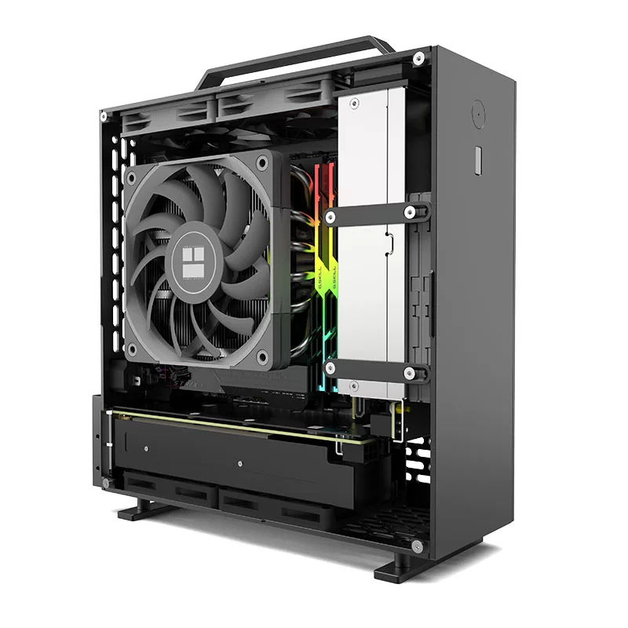
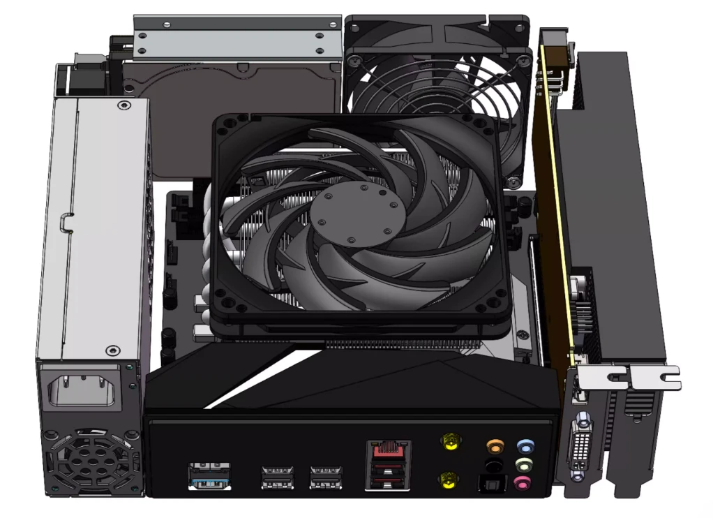
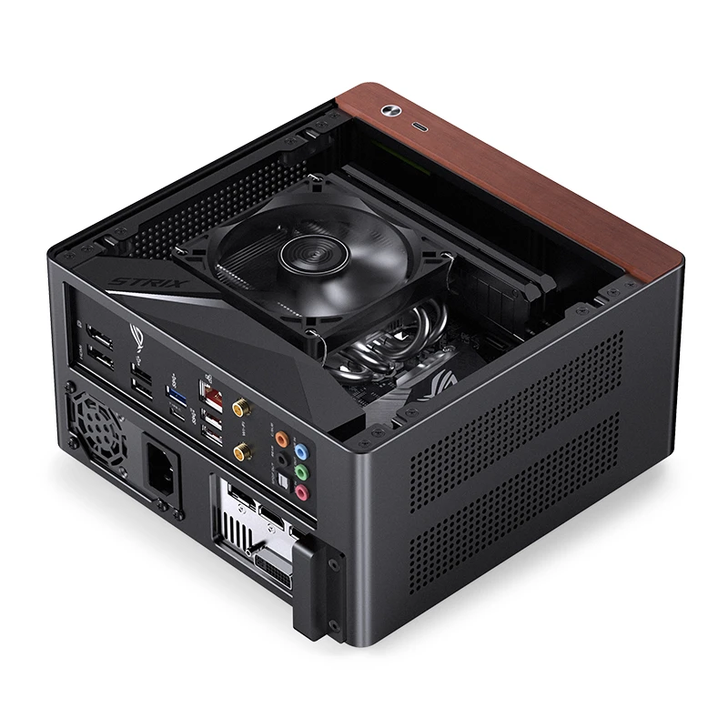
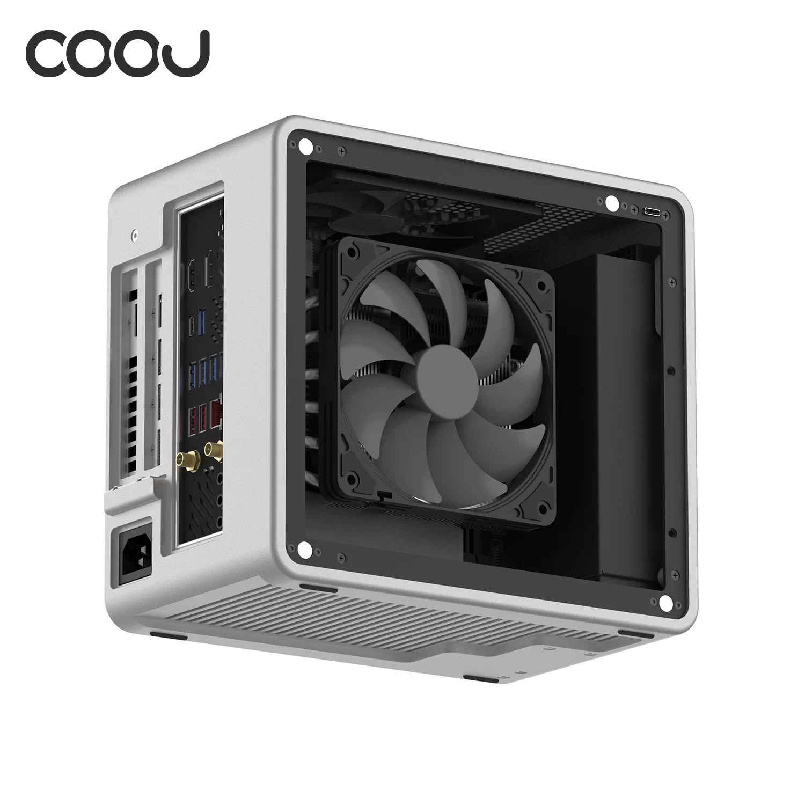
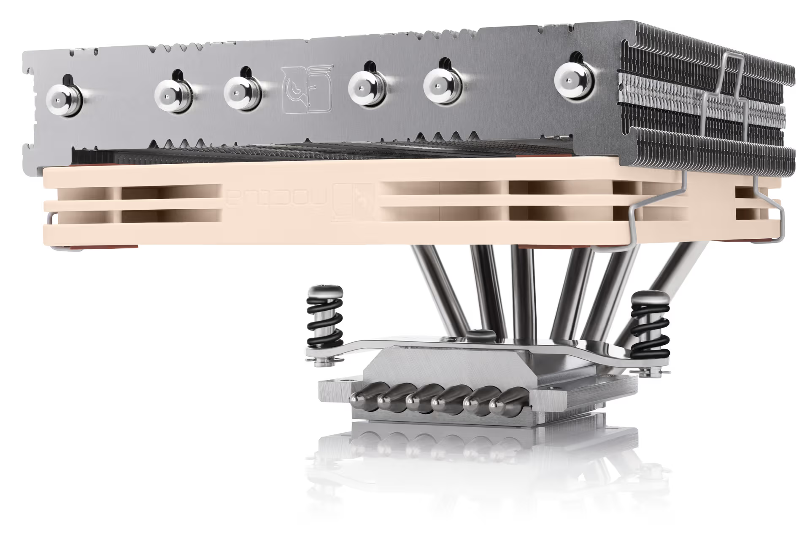

很多人喜欢 SFF (Small Form Factor) PC (真的很可爱), 但 SFF 对装机的要求是最高的: ATX 机箱丢什么进去都能安静跑满, SFF 就得考虑兼容性, 性能损失和噪音.

这里不推荐配置单, 而是聊几个在下单前必须想明白的事情.

## 结构比体积更重要

圈子里喜欢比体积, 但真正决定散热的是结构, 结构决定兼容性和散热上限 (当然可能还有颜值). 好的机箱是和谐的: 结构好看, 安装友好, 又能散热.

这里有些 7L 以下的, 结构还算合理的机箱样例. 现在同类竞品都不少, 并且一直有人在出 (抄) 新品, 因此不一定要买图中的款式.

> 从热力学角度看, 和 ATX 相比, SFF 的热密度都高到离谱, 这是任何设计都无法逃避的物理定律.
>
> 有的激进设计把显卡或 CPU 风扇裸露在外面. 这样很独特, 但也增加了日用风险: 小心液体 / 异物进入风扇.

### 经典直插

LP 显卡直插主板, 机箱顶部直接出风, Flex PSU 侧置. 简单又科学的风道. 算国外 SFF 社区非常流行的国产机箱了 (对它们来说哪怕算上运费都比 Velkase 划算, 品质还更好).

对 CPU 散热极其友好. 缺点是需要电源转接线. 如果用 67mm 散热器, 很可能被迫要朝向内存那边 (内存条不得过高).

### 倒置直插

LP 显卡直插主板, 但主板倒置. 虽然阻碍了空气自然上升, 但实际散热效果很好.

稍微委屈了 CPU, 也稍微照顾了显卡. 最好像图中那样, 有前侧的出风风道.

可惜只能用最高 67mm 的散热器. 如果能到 77mm, Noctua 的 NH-L12Sx77 是当下的好选择 (可以上吹而不是下压).

### 迷你三明治

有两种: MQ6 更像 A4 的三明治结构, 用短的全高卡, 散热好但体积大; NV10 用半高显卡, 非常紧凑, 散热困难.

顺便一提, NV10 有辅助显卡散热的 [3D 打印套件](https://www.printables.com/model/1368113-3x-40mm-fan-bracket-for-jonsbo-nv10-mini-itx-case) by ITG Gear: 3 个 40mm 风扇抽出鳍片的热风, 效果显著.

### 其他机箱

稍微提及一些更大的 SFF, 我们不讨论它们:

- FormD T1 那样的**经典三明治**, 适合低功耗 CPU + 高端显卡.
- Jonsbo TK0 的**短卡直插 + 背部 SFX 电源仓**, 也有没侧板的小体积 "海景房" 方案.
- 各种**平铺机箱**. 比较扁, 便于携带, 但...沉, 而且我觉得不好看. 至于主打的散热, 冷暖自知, 不做评价.

这些机箱的散热压力普遍小: 如果给了 7L 甚至 10L 的体积还不能放开跑, 那这设计也真令人失望.

当然还有外置电源, 或内置医疗电源的方案, 其实结构类似, 能用的就那几种. 我不想讨论 lop300 这种并非面向 PC 市场的 PSU.

不论做什么选择, **机箱选定, 基本就限定了: 显卡尺寸, 散热器限高, PSU 类型.** 这是我们后面的调整空间.

> 我不会聊太多显卡: 对于 7L 以下的小机箱, 它们能上的显卡往往很少, 无非就是单风扇或半高卡, 可能就一两款, 所以没什么好挑的.

## 散热器限高决定了 CPU 功耗上限

SFF 几乎清一色是 36-67mm 的下压式散热器. 这类散热器的能力主要由塔高决定. 一般这类散热器都是 15mm 的薄扇.

根据经验, 以利民 AXP90 系列为参照:

| 散热器高度 | 持续功耗 | 适合的 CPU                           |
| ---------- | -------- | ------------------------------------ |
| ~36mm      | 65W      | 7800X3D / Ultra 5 225                |
| ~47mm      | 88W      | 9700X (默认)                         |
| ~67mm      | 120W     | 9700X (解锁 105W TDP) / Ultra 5 245K |

这里说的是**持续负载, 风扇安静**下的情况. 如果只是打游戏, 负载一般比这低很多. 如果你看到更激进的数据, 多半没有考虑噪音和长时间全核满载.

也可以在 [Noctua 兼容性查询](https://www.noctua.at/en/compatibility/by-components/cpus)里搜索你的 CPU. Noctua 官方的数据用来参考还是挺不错的.

> 对于 Intel CPU, 我们只假设长期负载下功耗满足 PL1 即可.

如果和表格不匹配, 比如一颗 9950X 上压了一块 AXP90-X47, 那... 其实也没关系! CPU 自己会降频, 一般不会烧毁, 但为了稳定我们还是手动做些限制.

**不是选克制的 CPU, 而是选克制的功耗.**

---

我还想提一下 [NH-L12Sx77](https://www.noctua.at/en/products/nh-l12sx77), 就是这货:

ID-COOLING 有个纯黑版本, 散热能力差不多. 这玩意可以走上吹而不是下压. **下压是从侧板孔洞吸冷风进来, 上吹是把机箱传递来的热气吹走, 因此高转速下没有湍流声 (风切), 还能帮助整个机箱排热.** 还有个好处是, 既然这里吹风, 那机箱风扇往往就适合进风, 风扇正面朝外要好看一些.

### 88W 是一个好的目标

这个功耗下, 大多数 CPU 的性能损失都在可接受范围内, 而散热器基本能安静压住. AMD 的 TDP 是总功耗的 0.74 倍, 也就是说: 当 **TDP = 65W** 时, 总功耗是 65W/0.74 = 88W.

举个例子, 假设你的机箱支持 AXP90-X47:

- **7800X3D**: 标称 120W TDP, 实际因缓存发热, 和 i3 一个功耗, 直接默认用. 顺便一提, 这玩意打游戏时能用 50W [秒掉 Intel 全家](https://gamersnexus.net/cpus/rip-intel-amd-ryzen-7-9800x3d-cpu-review-benchmarks-vs-7800x3d-285k-14900k-more).
- **9800X3D**: 坏了, 它标称 120W, 实际真能跑到 120W. 可以看情况给个 88W 的功耗墙.
- **9950X**: 170W TDP, 也就是 230W 总功耗. 我们给个 88W 功耗墙, 功耗直接砍到 40%. 单核或游戏内几乎没影响, 总性能降低...但仍然远强于任何 8 核家用 CPU, **仍然是迷你工作站的好选择.**

想了解 CPU 甚至 GPU 的话, 推荐看 [TechPowerUp](https://www.techpowerup.com/) 的评测, 非常全面.

> 我个人也用 7950X 做了不少测试, 例如 88W 的 7950X 在生产力上类似默频的 12900. Club386 的 [9950x](https://www.club386.com/heres-what-happens-when-you-run-an-amd-ryzen-9-9950x-at-65w/) 和 [285k](https://www.club386.com/heres-what-happens-when-you-run-an-intel-core-ultra-9-285k-at-65w/) 测试结果更详细可信, 可看.

### 88W 下该选哪块 CPU

- 游戏: X3D, 没有第二选择. 大三缓对游戏场景是降维打击, 不管单机还是网游.
- 渲染, 仿真, 多开, 虚拟机: 9950X 或 Ultra 9 285K. 51972 的[测评](https://www.bilibili.com/video/BV1UsyYBnEz4)可供小白参考.
- 日常, 轻办公, 影音: 认准 Intel i5 / Ultra 5 (带核显款). 待机功耗低, 核显解码很强.
- 预算有限, 希望均衡: 9700X (单 CCD, 有核显, 非大小核, 频率够高)

### 要不要换把散热器风扇

关于换扇: 很多实验 (包括我实测) 表明:

- 90mm 塔体换 25mm 厚扇的用处不大, 薄扇足以吹透了.
- 90mm 塔体换 120mm 风扇, 内存散热稍好, CPU 散热变化不大.

还有个事: 散热器高度不要太极限, 进气扇贴近侧板孔洞时会产生湍流 (风切), 会扰乱气流, 而且那声音很难听.

## 调教你的设备

机箱和 CPU 选定后, 做点一次性调整, 可以让机器不浪费性能, 运转更顺畅.

### 如何设置功耗墙

总功耗可以在主板 BIOS 里限制. 不同主板不太一样, 但总体差不多:

- AMD 找 PPT Limit
- Intel 找 PL2.

### 如果撞温度墙

现代 CPU 撞温度墙会自动降频, 这是正常的热管理, 不是硬件故障, 安心就是.

适当负压可以略微降低相同性能下的热量.

### 关于负压

如果你不清楚这个词的意思, 就不用管了. 如果要做负压:

- 40xx / 50xx 显卡出厂电压普遍给得特别高, 适合给负压. 如果你的游戏帧率正好卡在 120/60 附近, 稍微降压超频, 说不定就上去了.
- X3D 给负压要谨慎, 体质不好容易抽帧 (英文社区叫 stutter).
- 如果跑起来没问题, 就不要负压. **远离把定频定压挂在嘴边的人.**

## 写在最后

SFF 装机的逻辑和普通 ATX 是反过来的: 不是先选 CPU, 而是先选机箱和散热器, 推导出 CPU 的上限, 然后按用途做选择.

想清楚这一点, 就能避开配置方面的坑. 至于组装方面的坑, 那就是另一个故事了.
