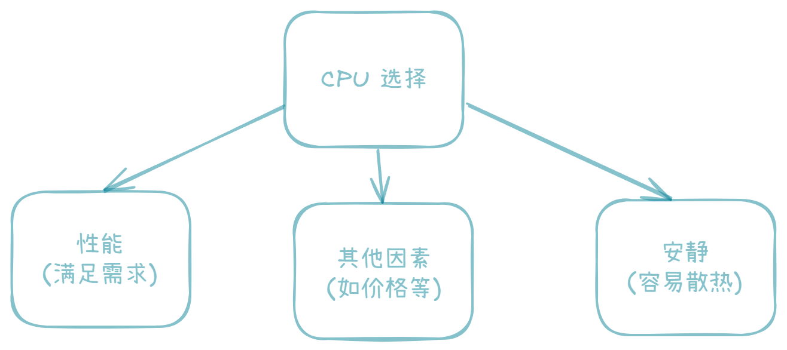
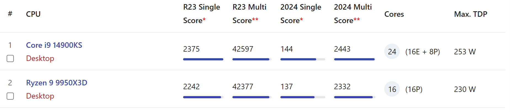
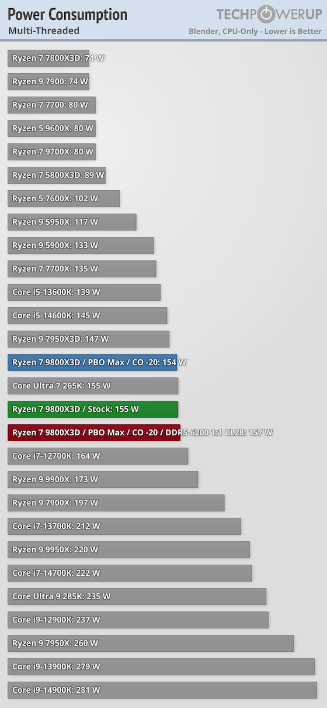
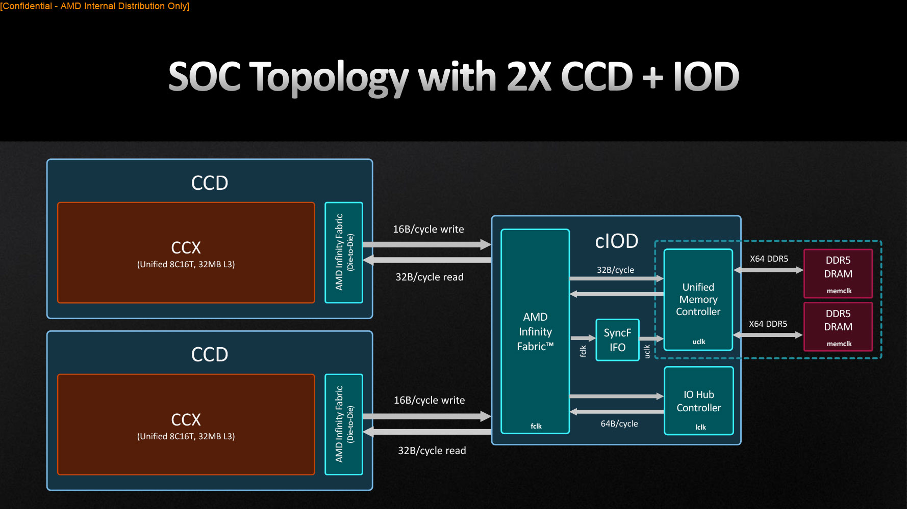

SFF (Small Form Factor) PC 的紧凑设计总能让我爱不释手, 但散热限制让 CPU 选择变得更有讲究, 我们需要在性能和功耗之间找到平衡点.

通过这篇指南, 我们可以一起了解各种 CPU 在 SFF PC 中的性能特点. 这里不会明确说哪块 CPU "最好", 因为每个人都有自己的需求.

如果懒得看那么一大串, 这里有份 tldr:

| 目标           | 选择                     | SFF 用户的调教               | 理由                                                                                                                                                                                                                                                                                     |
| -------------- | ------------------------ | ---------------------------- | ---------------------------------------------------------------------------------------------------------------------------------------------------------------------------------------------------------------------------------------------------------------------------------------- |
| 竞技游戏       | 7800X3D, 9800X3D         | 9800X3D 限制在 90W, 其他默认 | 多数竞技游戏对缓存敏感性远大于频率                                                                                                                                                                                                                                                       |
| 模拟, 计算     | 7950X, 9950X, Ultra 285K | 限制在 90W, 可负压           | 即便限制功耗, 也只有他们称得上 "家用服务器", 与其他 CPU 多核差距很大. 见 clubi386 测试 [9950x](https://www.club386.com/heres-what-happens-when-you-run-an-amd-ryzen-9-9950x-at-65w/), [285k](https://www.club386.com/heres-what-happens-when-you-run-an-intel-core-ultra-9-285k-at-65w/) |
| 播片与办公     | Ultra 3 205, Ultra 5 255 | Ultra 5 需要锁 pl1=pl2=90W   | 待机功耗与核显视频解码仍然是 Intel 更强                                                                                                                                                                                                                                                  |
| 有限预算下全能 | 7700X, 9700X             | 限制在 90W                   | 非大小核, 非双 CCD, 频率高, 缓存不小, 带亮机核显, 任何场景下都不会错                                                                                                                                                                                                                     |

## 装机之前: 明确需求

在装机之前, 我们得想清楚要用这台 PC 做什么, 也就是**需求**. 您肯定知道 CPU 是用来做计算的. 我们常见的用途有这几种:

- **生产力** (仿真? 模拟? 制图? 渲染? 开发?)
- **玩游戏** (单机? 网游? 模拟类?)
- **轻用途** (网页? 播片? Office?)

当然, 我们也希望装出的 SFF PC 尽可能**安静**而**凉快**, 这对使用环境和硬件健康有好处.

目前的装机主流是 AMD Ryzen 7000/9000 系和 Intel Core Ultra 200 系, 我们就从它们聊起.

## 各有所长的 CPU 产品

现代任务往往是并行的, 所以 CPU 也设计有很多核心. 性能主要分单核和多核. 在介绍核心数量的时候, 我们也可以顺便对各种型号的 CPU 有个基本认识. 我想用 AMD Ryzen 7000 的产品线为例 (它的命名相对清晰) 来说明各 CPU 的基本情况.

| CPU             | 核心 (C) 线程 (T) | 备注                                 |
| --------------- | ----------------- | ------------------------------------ |
| Ryzen 5 7500F   | 6C 12T            | F 结尾表示无核显                     |
| Ryzen 5 7600X   | 6C 12T            | X 结尾表示含核显                     |
| Ryzen 7 7800X3D | 8C 12T            | 基本是游戏专用, 纯计算性能不如 7700X |
| Ryzen 7 7700X   | 8C 16T            |                                      |
| Ryzen 9 7900X   | 12C 24T           | 可以视为两块 7600X                   |
| Ryzen 9 7950X   | 16C 32T           | 可以视为两块 7700X                   |

### 性能指标

衡量性能的指标可以分为这几类:

| 性能指标 | 影响的场景                                               |
| -------- | -------------------------------------------------------- |
| 单核     | 基本的交互和响应速度; 许多游戏的帧率; 少量未优化的老软件 |
| 多核     | 最主要的性能指标, 影响绝大多数软件, 尤其是生产力         |
| 缓存     | 充分大的缓存对多数游戏有极大帮助; 虚拟机场景也用得到缓存 |

> 总的来说, 现代 CPU 只要不是 i3, 单核都足够强, 差异不大. 多核性能才是真正拉开差距的地方. 这也是 AMD 和 Intel, 甚至 Apple 这些年都在疯狂堆核心数量的原因.

那么如何衡量 CPU 的性能呢? 有种办法叫**跑分** (benchmark), 它让 CPU 计算一系列通用任务. 谁跑得更快, 谁得分就更高.

### 衡量性能的最佳标准: R23

衡量 CPU 性能的最佳 benchmark 仍然是 **Cinebench R23**. [NanoReview](https://nanoreview.net/en/cpu-list/cinebench-scores) 提供了一个较为全面的得分列表.

> 我们只关注 R23 (多核), 它使用较为通用的计算方法, 所以数据更贴合实际应用. 后面 "2024" 两列更适合作为渲染方面的专用 benchmark.

对于 SFF PC, 任何功耗超过 100W 的 CPU 都可能对散热带来困难. 最终使用时我们会手动限制功耗, 从而降低性能. 一般来说, **限制功耗时, AMD 的性能损失要远少于 Intel**, 尤其是对顶级 CPU 而言.

当然, 对于特定的生产力领域, 我们也可以直接参考 [2025 主流消费级 CPU 生产力测试](https://www.bilibili.com/video/BV1UsyYBnEz4/) 的结果, 但该结果仍然没有考虑 SFF PC 中的功耗问题.

- 值得一提的是, **单核性能几乎不受散热影响**, 这对游戏爱好者是好消息.
- 另外, 对于多数游戏, AMD 的 **X3D** 型号处理器都有明显优势, 因为它有极大的缓存. 关于劣势, 可以参见 [附 1: 关于 AMD 的 X3D](#附-1-关于-amd-的-x3d).

了解了 CPU 性能指标后, 接下来的关键问题是: 在 SFF 的散热限制下, 这些性能能发挥到什么程度? 这就涉及到功耗管理.

## Part 2: 功耗

刚刚已经提到过, 受限于散热条件, SFF PC 中的高端 CPU 往往需要在限制功耗的情况下工作. 根据个人经验, 我会重点考虑 CPU 在 **88W** 下的性能表现, 在我看来这是性能和功耗的一个平衡点. 接下来我们要说两件事:

- 散热器能承载的功耗, 以及适合的 CPU
- 如何看待功耗限制这件事

但在此之前, 有个概念要和大家澄清.

### 厂商的取巧

在功耗方面, 厂商有个取巧的行为. 当我们讨论 CPU 所需的散热器强弱时, 往往看的是**封装功耗**或**功耗墙**而非 **TDP**:

- 对于 Intel, 真正的功耗墙是 **PL2**
- 对于 AMD, 真正的功耗墙是 **PPT Limit**

这些参数可以在对应官网查到, 多数主板都支持对这些参数进行调整. 另外, 每个散热器的**解热能力**也可以通过官网或客服了解. 得益于这些厂商的肆意宣传, 这个解热能力和上述封装功耗**没有任何对应关系**.

### 经验: 散热器功耗对照表

有许多解热能力比较弱, 但在 SFF 中比较常见的低矮散热器. 机箱卖家一般会告诉你散热器限高, 然后你就可以买一个尽可能强力的散热器了. 下表是一组经验性数据, 以利民的 Axp90x36/x47/x67 为参照物. 其他散热器只要高度差不多, 结果也一般差不多, 或者不同平台互有胜负. 注意, 我们的目标是**维持散热器风扇安静**, 同时能**承载持续性负载**而非仅仅打个游戏, 所以你看到的数据可能比网上多数人要保守.

| 散热器    | 适合的封装功耗 | 适合的 CPU                                                                      |
| --------- | -------------- | ------------------------------------------------------------------------------- |
| Axp90-x36 | 65w            | 7800X3D 或 Ultra 3 可以默认状态下使用; 不推荐 7950X/9950X (双 CCD 周边功耗太高) |
| Axp90-x47 | 90w            | 任何 AMD CPU 的 88w PPT 模式; 任何 Intel CPU 限制 PL2=90W                       |
| Axp90-x67 | 120w           | 任何 AMD CPU 的 88w PPT 模式; 任何 Intel CPU 限制 PL2=90W                       |

> 粗略地说, 风扇的风量 Q 正比与 N^1 D^3, 噪音 W 正比与 N^5 D^2, 其中 N 是转速, D 是直径.

你可能好奇为什么 7800X3D 的功耗需求那么低, 或者为什么即便能手动调整功耗墙, 也不建议 65w 解热能力时使用 Ryzen 9. 这方面的理论见文末 [附 1: 关于 AMD 的 X3D](#附-1-关于-amd-的-x3d) 和 [附 2: 关于 AMD 的双 CCD](#附-2-关于-amd-的双-ccd)

> 可以在 [TechPowerUp](https://www.techpowerup.com/review/amd-ryzen-7-9800x3d/23.html) 看到许多评测, 其中有各种场景下的功耗数据对比 (例如下图是一组多核数据). 他们的评测不依赖软显, 直接通过硬件读取功耗, 结果非常准确.

### 性能发挥程度

仍然以 AMD 为例. 一般来说, CPU 越强, 功耗损失的就越多. 假如我们限制 PPT 在 88W, 那么:

- 任何 CPU 的单核性能都几乎不变 (所以我们只讨论多核性能).
- 7700X 的默认 PPT 为 142W, 限制后实测损失约 7% 性能. 用 7% 性能换取 39% 功耗, 这个数字非常棒.
- 9700X 的默认 PPT 就是 88W, 不损失任何性能. 然而, 9700X 的规格只是 7700X 的常规提升, 并没有功耗上的优化, 这说明默认 PPT 只体现厂商的调度策略.
- 7950X 在 88W 下损失 25-30% 性能. 尽管如此, 此时的 7950X 还是强于任何 (哪怕 9000 系的) 8 核家用 CPU.

### 如果撞温度墙该怎么办

现代 CPU 的工作方式很智能, 在到达温度墙时会自动降频. 降频不是警告, 是 CPU 在较弱散热条件下的一种自我调节措施, 不管对硬件还是人类这都无害, 且这是让 CPU 充分释放性能的最好方法.

事实上, 撞温度墙在各种笔记本电脑里**很普遍**. 然而, 有些 CPU 的默认温度墙 95°C 甚至 100°C 可能确实较高了, 我们可以在 BIOS 里**将温度墙手动降低**.

我还建议通过**降压超频**来提升 CPU 性能. 低功耗场景下, 降压超频的效果往往十分显著. **正确的降压超频同样对硬件无害**.

## 附录

### 附 1: 关于 AMD 的 X3D

AMD 的 **X3D** 堆入了更大的缓存, 这使其特别适合**现代游戏场景**. 那么代价是什么呢? 代价是消费者接受了这种误导性的命名:

- 7800X3D 实际上是 **7600X-8c-X3D** 而不是 **7800X-3DCache**: 它本质上是一颗 8 核而非 6 核, 带有 3d v-cache 的 7600X
- 9800X3D 实际上是 **9600X-8c-X3D** 而不是 **9800X-3DCache**: 它本质上是一颗 8 核而非 6 核, 带有 3d v-cache 的 9600X

3d v-cache 当然增加了缓存, 但作为发热的代价, 它的主频不能太高, 只能和 Ryzen 5 一个水平, 最终反而导致功耗下降. 以 7800X3D 和 7600X 的 R23 跑分为例, 它们单核几乎一样, 多核性能大约为 8:6.

9800X3D 的功耗没有 7800X3D 那么低, 主要是因为这一代 AMD 的倒置结构在一定程度上解决了 3d v-cache 发热的问题, 将频率提升了一些, 所以功耗能上去了.

### 附 2: 关于 AMD 的双 CCD

然后是 **双 CCD** 设计. 这发生在 AMD 的 Ryzen 9 上. 以 Ryzen 7000 系举例:

- 7900X 相当于两颗 7600X 塞到一起, 且其中有一颗的体质往往较好
- 7950X 相当于两颗 7700X 塞到一起, 且其中有一颗的体质往往较好

我们能看到, 7950X 具有 64MB 大三缓, 但它其实是两块 32MB 的三缓, 所以**不会给游戏性能带来额外提升**. 这些 CPU 需要正确安装 AMD 的芯片组驱动, 它们将 8 核以内的负载 (例如常见的游戏) 集中到体质较好的那颗 CCD 上, 这样主频会比 7700X (7600X) 高一点.

另外, 双 CCD 的 CPU, 在相同功耗下, 其面积更大, 热量更均匀, 这略微有利于散热; 然而, 因为需要额外的控制器, 其**待机功耗相当高**. 当然, 任何 AMD 的 CPU, 其待机功耗都相当高, 在这方面 Intel 做得比较好.

### 附 3: 所谓 AMD 积热

很多人称 AMD 积热, 其实一定程度上和 CPU 调度策略有关.

- Intel: 有两个功耗墙: PL1 和 PL2. PL2 是最大功耗墙, 数值较高; PL1 则是持久功耗墙, 数值较低. Intel CPU 不允许长时间处于 PL2, 会回到 PL1, 此时 CPU 的性能就受到限制, 但是也比较凉快.
- AMD: 只有一个功耗墙 PPT Limit. 只要散热允许, AMD CPU 可以一直跑满 PPT, 这样对释放性能最有利.

> AMD 的真正问题是, 7000 系发售时 BIOS 电压给的过高, 导致确实不太好压, 甚至 X3D 型号烧毁. 这个问题早就修复了.

### 附 4: 工业软件中的 CPU 歧视性调度

早些年的 Intel 是科学计算的王者. 科学计算方面, 有两个东西非常重要:

- BLAS: 定义了矩阵和向量的运算接口
- LAPACK: 定义了线性代数相关计算的接口

对于它们的实现主要有两种:

- MKL: Intel 的实现, 闭源
- OpenBLAS: 开源实现

我们用的多数工业软件都用到这些实现. 所谓歧视性调度是指, Intel 给 MKL 动了手脚: 如果检测到 AMD CPU, 它就使用落后的指令集. 如果较老的工业软件使用 MKL, 我们的 AMD CPU 就可能运行得非常慢.

所幸近几年这个问题有得到缓解. 例如 MATLAB 大约在 2020 年为 AMD 默认使用 "满血版" MKL, 此时 Intel 就没有明显性能优势了. 另外, 许多软件支持使用 OpenBLAS. 经过长期的优化, 现在 OpenBLAS 的性能也和 MKL 不相上下. 也许这才是问题解决的根本原因吧.
