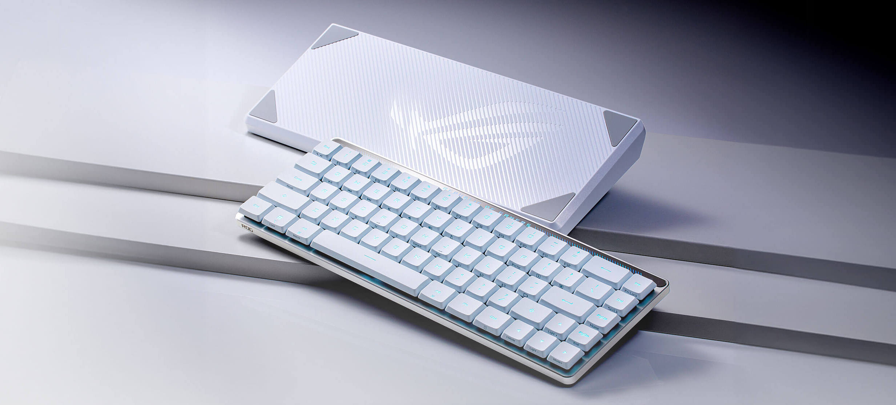
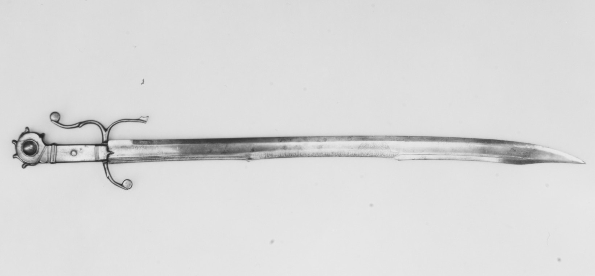
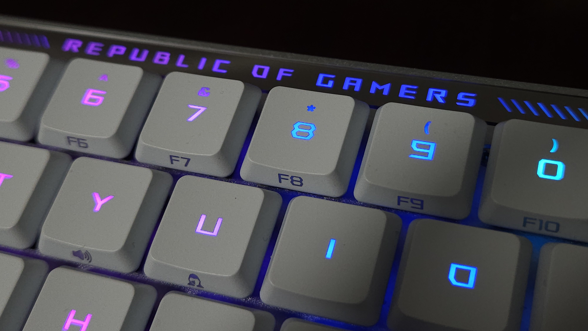
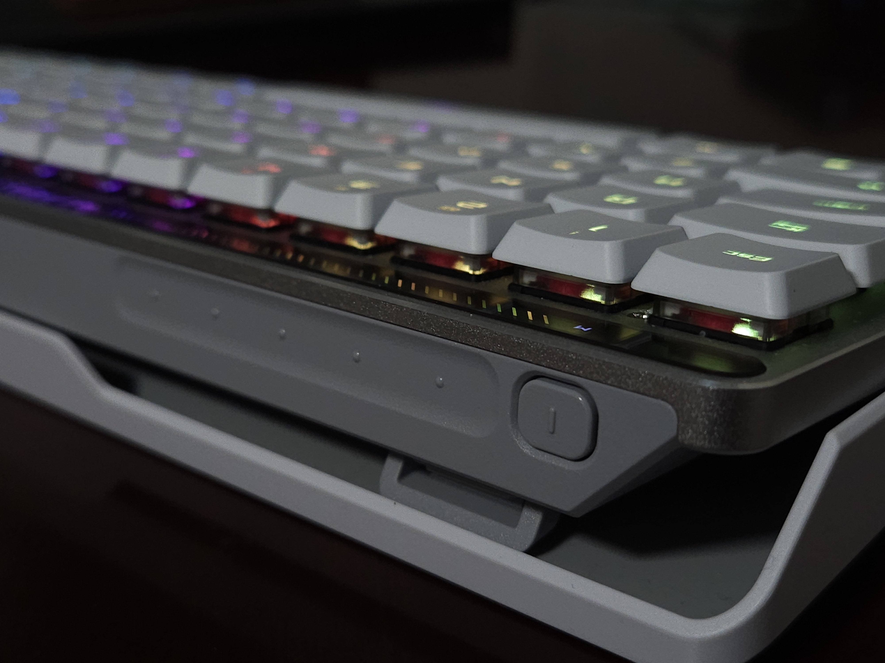
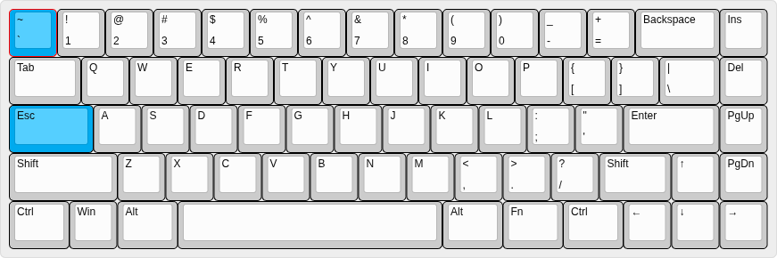

很多人恋旧, 其实恋的是一种习惯, 习惯会带来稳定性. G915 TKL 就是我的恋旧, 它可靠, 稳定, 内敛.

- **可靠**: 2.4G 接收器如同有线般无感, 连接即可用; 续航极长.
- **稳定**: 延迟低, 信号耐干扰, 连接距离长; 休眠唤醒无感.
- **内敛**: 外观沉稳, 灯光简洁.

这简单的 6 个字几乎排除了所有键盘. 例如有的厂商用 Nordic 芯片但是调教能力不行, 实际用下来抗干扰能力不够强, 偶尔丢键. 因为做不好电量管理, 为了提高标称续航, 只能用激进的休眠方案, 键盘唤醒时就卡顿. 还有的键盘外观像玩具, 键帽不透光, 灯光只从缝隙透出. 这种偶尔看看还行, 长期使用很容易厌倦.

诸如 G915 轴体不稳, 影响手感的毛病, 和这些相比压根不算什么. 那些形形色色的铝坨坨, 虽然手感极好, 但基本的连接性得不到保证, 可远观而不可亵玩.

但这并不意味着我会一直用 G915. 它已经在我这服役了 1000 多天, 已经脱离时代了, 那个 micro-usb 接口就是最好的证明. 是时候让它退休了.

所以我捡了把 Falchion RX LP. 这是一把 65% 配列的键盘. 在商场摸到它时, 我被它**极佳的手感和外观**吸引了.



华硕的国内运营喜欢乱翻译 (天选, 幻, 还有这里的魔导士). Falchion 其实是这玩意:



我这把是**线性**轴, 还有**段落**轴可选, 不过段落轴似乎品控不太好, 我也不建议用段落的矮轴 (这破坏了矮轴独特的轻盈感).

各种键盘的评测都可以去 [rtings](https://www.rtings.com/) 找找, 包括这把. 我的观点和他们略有不同, 例如他们测无线延迟时不考虑抗干扰, 于是有把键盘延迟得分超高, 但某薯和阿 B 那里有好多人抱怨断触.

延迟也是我在购买前担心的主要问题. ROG 在 rtings 上还有黑历史呢. rtings 测评指出某把键盘有较高的抬起延迟后, rog 联系他们, 宣称已经通过固件更新解决, 但实际上没有. 他们没想到 rtings 十分较真, 真重测了一次, 于是这件事被 rtings 挂了出来...

## 不止是花架子

键盘外观赏心悦目! RX LP 低调但细节出色, 灯光也够漂亮. 顶部的镜面横条平衡了视觉, 让键盘显得不太瘦, 我能 get 到这里的设计.



上手敲击, 最直观的改进在**轴体**上. RX LP 用他们自己的轴体, 形状如火山口, 留给键帽的插脚有 4 个, **手感特别稳**. 大键似乎也是润滑过的, 不赘述. 这个轴体中心还有个灯柱, 能把**灯光**温和地透出.

RX LP 用 **ABS** 键帽且几乎没法替换. 多数 ABS 键帽在我这双硫酸手上的寿命不超过 3 个月. 我左手侧的键组已经明显比右手侧的光滑不少了, 预计 3 个月时会有抛光感.

> 有第三方的零件, 可以牺牲这个灯柱来替换 MX 轴键帽. 但 RX LP 的大键尺寸不标准, 所以... 另外有个人做了铝合金 CNC 的键帽, 开了好几个号来宣传, 一套卖 2000~3000 元.

敲击感方面, 无论写代码还是玩游戏都挺舒适. 矮轴的精华在于轻盈, RX LP 做得很棒. 另外有个凑数的触摸条, 响应不够迅速, 还很容易误触, 我不太喜欢.



在刚收到货那天, 要想用 2.4G, 我得先切模式, 再插接收器, 反过来是不行的. 今天我又试了下, 已经正常了. 30 多天下来, 即便我把多个接收器直接插在机箱背面, RX LP 仍然没有漏掉任何一次敲击, 算是通过考验了.

总的来说, 纯考虑硬件, 和 G915 的改款 G915X 相比, RX LP 轴体更好, 灯效差不多, 键帽材质见仁见智 (G915X 用了字透的 PBT, RX LP 只是 ABS + 涂层), 两者的差异主要在配列. 最近我想逐渐**淡化 F 区** (就像 MacOS 那样), 所以 65% 的配列在我这里胜出. 我抵挡不了小巧的东西, 就算用不习惯, 挂墙上看着也开心.

## 一团糟的软件

软件方面, 我期待 ROG 宣传的 [Gear Link](https://gearlink.asus.com), 即国内常说的 "web 驱动" (尽管我不知道 "配置软件" 是怎么变成 "驱动" 的). 但直到此时, Gear Link 支持的设备仍然不包括 RX LP.

于是我只能切回 Windows, 然后安装 Armoury Crate 奥创. 比起奥创, 雷云都显得眉清目秀, G HUB 更是美若天仙. 好在有个专用于 RX LP 的版本, 用那个能省很多时间.

尽管如此, 奥创的功能还是太少了. 众所周知, **只有能板载的配置才有意义**. RX LP 的任何 `Fn` 组合键是**写死的**. 例如, 就算把 `Esc` 更换成 `` ` ``, `` Fn + ` `` 也仍然是原先的 `` Fn + Esc = ` ``. 板载的硬件宏录制保留按键时的延迟, 而软件宏录制又**不能写入板载**, 且宏只能绑定单键. 也就是说仅仅依赖官方的软件, 你没法把 `Capslock + 1~9` 无延迟地绑定到 `F1~F9`. 嗯, 这让我费了些功夫...

如果支持 QMK 就好了.

### 用 keyd 重映射按键

最大的问题是 `Fn` 在右侧, 于是 **F 区不能用左手搞定**. 为了解决这个问题, 我思索了一段时间. 我的设想大概是这样的.



- 将 `Esc` 恢复到 `` ` ``
- 将 `Capslock` 映射到 `Esc`
- 用 `Esc + 1` ~ `Esc + =` 映射 `F1` ~ `F12`

前两点都可以用奥创写到板载, 但第三条很麻烦, 需要借助其他软件重映射 (也就是说键盘没法抱到哪用到哪了). 有个跨平台的 [kanata](https://github.com/jtroo/kanata) 可能能做到, 但我既然固定在 Linux 上, 就用性能更好的 [keyd](https://github.com/rvaiya/keyd).

只需要写个配置文件 `/etc/keyd/default.conf`:

```conf
[ids]
*

[main]
esc = overload(f_layer, esc)

[f_layer]
1 = f1
2 = f2
3 = f3
4 = f4
5 = f5
6 = f6
7 = f7
8 = f8
9 = f9
0 = f10
- = f11
= = f12
```

配置文件基本就是在说, 在按下 `esc` 时键盘被切换到 `f_layer` 层. 该层下 `1` ~ `=` 分别对应 `f1` ~ `f12`.

嗯, 这就搞定了. 我适应了几个小时, 然后用到了今天, 还算满意.
