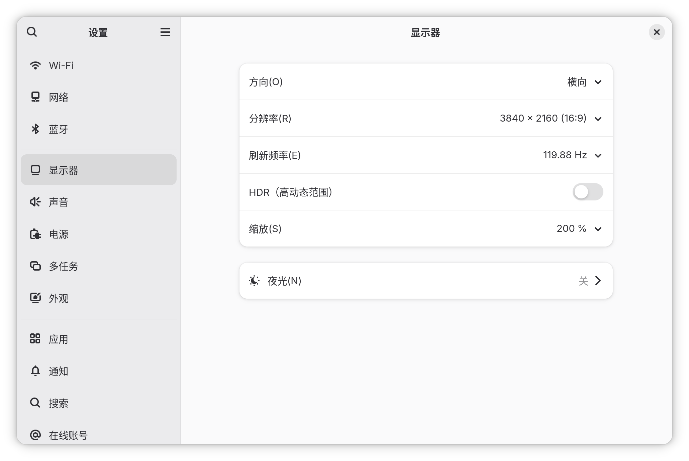

我认识 Linux 已经快一年半了. 从一台 Surface Go 开始, 到完整的 SFF 主机, 它们全是 Fedora Linux.

最近我偶尔会逛商场. 每当看到精致的折叠手机或迷你平板时, 我都有想把它刷成 Fedora 的冲动 (可惜并不能). Linux 有太多点让我喜欢了.

让我把这些好处告诉 (也许完全不了解 Linux 的) 你.

## 为什么是 Linux

如果不是 Linux, 那就得是 Windows 或 macOS 了.

每当我不得不用 Windows 系统, 一些不好的记忆就涌上来, 比如微软雅黑字体, 微软的特权软件, 在线账户, 四世同堂的 UI, 注册表, "重启并更新"...

嗯, 不知道该从哪里开始吐槽, 但肯定不是 Windows. 至于 coding 的体验... 懂的都懂. 其实这些都不重要, **我只是不想面对一个雕花的老古董系统.**

macOS 呢? 它至少可用: 社区不错, 开发积极, 硬件强大且深度集成. 但它的各种细节总是和我反着来, 不能开箱即用, 一个个配置简直是种折磨. 如果想玩游戏, 渲染没有 Vulkan. 并且 macOS 的系统遥测和开销... 甚至比 Windows 还过分.

**乔布斯在十几年前就说了 "It just works" 这样的理念, 但今天的 macOS 完全没做到.**

> 但 ⌃⌥⌘ 绝对是优良传统. (希望 Windows 用户看这些不会是方块字符...)

所以只剩 Linux 了.

## 软件分发: 包管理器

其他的系统里, 人们一般靠应用商店或官网来获得软件包. Linux 普遍使用包管理器. 输入一行命令, 你就获得了软件.

包管理器最大程度省下了我们的磁盘空间: 假如 A 和 B 都依赖 C, 那么只有一个 C 被安装, 不会有 A.C 和 B.C. 包管理器还对 coding 特别友好.

`dnf` 或 `apt` 和系统深度集成, 确保一切东西都是最简单的. 包管理器实际上管理**整个操作系统**, 包括其内核, 基础库, 且软件包由发行版做测试甚至轻微的优化. Windows 有 `choco`, macOS 有 `brew`, 但它们没法确保和系统组件不冲突或重复, 包的质量也参差不齐.

**任何操作系统都需要一个包管理器, 且只需要一个包管理器. 如果认可这一点, 那么它就应该是系统集成的.**

当然这是理想的状况, 实际上就算 `dnf` 也缺失不少包. 另外, 微信或 LocalSend 这类东西没必要动我的全盘文件, 给他们个目录用就够了. 好在 Linux 总是有解决方案, 有 `flatpak` 这类东西: 它们把应用打包, 然后在沙盒里运行. 这种打包方式就不依赖发行版了.

但 `flatpak`, `AppImage` 这类也总是导致各种问题: 组件冗余, 兼容性, 等等, 但这是一种必要的代价: 虽然人性本善, 但也总要有个地方收容恶人和懒人.

如果你开始对 "命令行" 这个东西感兴趣, 我建议你从包管理器开始认识 shell, 然后了解 POSIX 标准下的基本命令. 这些命令从上个世纪用到今天仍然不过时.

## Gnome 是简洁的哲学

我不理解为什么会有人用 Linux 但不用 Gnome. 例如跑去用 KDE, 那比 Windows 的设置还复杂.

可以去 [Gnome Project](https://www.gnome.org/) 看看他们的工作. 或者, 来和我一起看看 Gnome 的设置:



简洁, 开箱即用, 对检索友好.

**很多事情只是被一些庸才包装才显得复杂. 正因如此, 把事情变得简洁才那么可贵.**

Gnome 还对触屏友好. 它在 Surface Go 上简直完美.

## 游戏体验其实挺好

关注硬件的人应该知道 Steam Deck 和 Steam Machine: Valve 定制硬件的, 基于 Linux 的游戏设备.

这种普遍兼容的游戏能力不是 Valve 设备独有的: Steam 提供 Proton 兼容层, `gamescope` 和 `mangohud` 只是普通的软件包, [Bottles](https://usebottles.com/) 也提供了对 Windows 软件的高性能转译.

基本上我测试了 4 个游戏: Dota2 (原生), DRG Survivor (转译, Deck Verified), 大富翁 8 (转译, 古老的游戏), 以及国服的坦克世界 (需要启动器拉起游戏和更新, 完全不进 Steam).

**这其中体验最差的居然是原生的 Dota2.** 直到今天我都没法在发轮盘时稳定自己的鼠标, 当然这也有 Wayland 的锅.

至于其他的方面: Linux 更简洁, 更能充分利用硬件性能. 得益于社区和 Valve 的工作, Proton 转译的效率高到令人惊奇, 所以我没感到任何性能差距.

把游戏添加到 Steam 里就能用 Proton 启动. 哪怕你讨厌 Valve, Bottles 预置了很多玩家友好的插件和环境, 为你省去很多心智负担 (虽然还是 Proton). 对于分辨率很低的老游戏, `gamescope` 可以任意拉伸并保持无边框窗口化, 这比 Windows 要好很多.

至于 macOS 那个残废, 它得用硬件弥补更多差距, 暂时不配上桌.

对了, 还有个东西对 Linux 很困难: 反作弊. 不过我不接触那些 "游戏", 暂时不做评价.

## 对硬件挑三拣四

Linux 非常挑硬件, 但这也是没办法的事: macOS 只用面对固定的硬件, Linux 面对的是无数种可能性.

还是用 Fedora 举例. 有些事情让我感到反常: Surface Go 明明是微软的设备, 但 Fedora 开箱即用: 键盘盖, 触摸屏, 手写笔, 蓝牙, 相机, 挂起.

但我的 SFF PC 却不行. 很多问题来自 Nvidia. 例如, Gnome 向导会在设置时区时因为 Nvidia GPU 而崩溃. 我需要用核显完成这个过程. 然后为了避免玩游戏时的 GPU offloading 问题, 我需要打好 [Nvidia 驱动](https://rpmfusion.org/Howto/NVIDIA), 然后反过来去 BIOS 禁用核显.

还有网卡. Linux 下的最佳桌面网卡就是 AX210. 我的 MT7922 连 WiFi 时总是跳 ping, 社区里讨论了几年的老问题了. 换上 AX210, 然后给 NetworkManager 换上 iwd:

```bash
sudo dnf install iwd
echo -e "[device]\nwifi.backend=iwd" | sudo tee /etc/NetworkManager/conf.d/iwd.conf

sudo systemctl disable wpa_supplicant
sudo systemctl stop wpa_supplicant
sudo systemctl enable iwd
sudo systemctl start iwd

sudo systemctl restart NetworkManager
```

呼, 然后 ping spike 消失了.


不能稳定挂起的问题也很恼人. 一大半得益于 [Nvidia 引起的挂起 bug](https://bugzilla.rpmfusion.org/show_bug.cgi?id=7090) (又是 Nvidia), 剩下的成分至今我还没搞定. 我已经养成了每次挂起前保存好任务的好习惯, 以防哪天它又一睡不醒.

> 我真希望 Intel Arc Pro B50 能再强点. 比起 Nvidia, 它肯定能保护我的脑细胞.

其他细微的问题也不少, 我举个例子. 明明 Linux 可以正常调度 7950X 的双 CCD, 但到 Bottles 里偏偏不行, 还得手动配置下 `WINE_CPU_TOPOLOGY` 环境变量. 而且, **回看这些问题, 定位反而比解决要更耗费精力.**

但这问题, Linux 自己反而很难帮上忙. 无论是服务器还是嵌入式, 各种设备都需要 Linux. 海纳百川的代价是细节的缺失.

## 我想聊点别的

Linux 的部分就这样了, 但生活还是继续着.

我把这一年半的经历讲述给 Claude, 让他以我的视角写篇 Linux 的博文. 在某一版中, 他生成了这样的话.

> Surface Go 在角落里吃灰的时候, 我有点难过. 不是因为浪费, 是因为那台机器本来很好, 只是被放在了一个不适合它的环境里, 然后开始变热, 开始降频, 开始什么都做不了. 装上 Fedora 之后, 它重新开始服役了, 一切都好.
> 
> 我有时候想, 如果能找到自己的 Fedora 就好了.

当时我将其评为 "无病呻吟", 但现在我又看了一遍这段话, 我觉得没那么糟糕. 不一定非要找到一个 Fedora, 但对 Linux 的探索这件事, 确实伴随了某些意识的苏醒.

直觉希望它附着的个体能更多了解这个世界, 从而为当下的问题找到某种答案.
